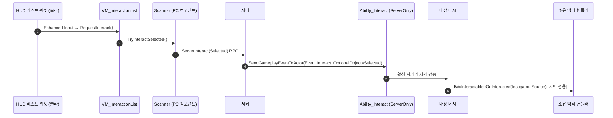

# 상호작용 시스템 — 등록과 실행

월드의 상호작용 대상이 어떻게 후보로 잡혀 HUD에 노출되고(등록·감지), 입력으로 어떻게 효과까지 실행되는지(트리거→기믹/지급)의 전 경로. 모듈 경계(WxCore / WxWorld / WxGame / WxUI / WxInventory)를 넘어 추적한다.

---

## 한 문장 요약

> PlayerController의 `UWxInteractionScannerComponent`가 소유 클라에서 주변 상호작용 메시를 주기 스캔해 로컬 목록·선택을 소유하고(감지=로컬 어포던스, 비복제), 입력 시 선택 메시를 `ServerInteract` RPC로 서버에 보낸다. 서버가 그 선택을 실어 `Event.Interact`를 폰 ASC로 송출하면 **ServerOnly** `UWxAbility_Interact`가 권위에서 발동해 활성·사거리·자격 검증 후 `IWxInteractable::OnInteracted`를 fire한다.

이 시스템을 가르는 세 축:

- **감지 vs 실행** — 감지(스캔·목록·선택·하이라이트)는 **로컬 전용**이고 어디에도 복제되지 않는다 / 실행(검증→효과)은 **서버 권위**이며 `OnInteracted`는 서버에서만 fire된다(클라 비주얼은 복제 상태로 수렴).
- **영역 = 메시 그 자체** — 상호작용 영역을 대표하는 별도 컴포넌트는 없다. 대상이 `IsInteractionMeshActive(Mesh)`로 메시 하나하나에 "지금 켜져 있는 내 영역인가"를 답하고, 이 판정 하나가 표식(어느 메시가 영역인가)과 활성(지금 켜져 있는가)을 겸한다. 콜리전 프리셋·응답은 자격에 관여하지 않지만 쿼리 콜리전은 켜져 있어야 한다 — 감지가 구 오버랩이고 사거리도 콜리전 형상으로 재기 때문이다. 무슨 일이 일어나고 뭐라고 표시되는지도 같은 인터페이스가 제공하며, 외곽선 강조는 선택을 소유한 스캐너가 단독으로 쓴다.
- **계약의 위치** — 계약 인터페이스 `IWxInteractable`가 `WxCore`에 있다. 소비 도메인(`WxInventory` 픽업 등)은 `WxWorld`를 전혀 보지 않고 인터페이스를 구현하는 것만으로 상호작용 대상이 된다.

---

## 전체 그림

```mermaid
flowchart TD
    subgraph 감지["감지 — 로컬 전용 (소유 클라/리슨 호스트)"]
        Timer["스캐너 스캔 타이머<br/>(PlayerController 컴포넌트)"] --> Scan["폰 주위 ScanRadius 구 오버랩 → IWxInteractable<br/>IsInteractionMeshActive + CanBeInteractedBy"]
        Scan --> Sort["거리순 정렬"]
        Sort --> Reg["Scanner.UpdateInRange()"]
        Reg -->|"OnListChanged / OnSelectionChanged"| VM["VM_InteractionList"]
        VM --> HUD["WBP_InteractionList (프롬프트·선택 표시)"]
        Reg -->|"ApplyHighlight"| Outline["선택 대상 메시 외곽선"]
    end
    subgraph 실행["실행 — 서버 권위"]
        Input["위젯 Enhanced Input → VM.RequestInteract()"] --> Try["Scanner.TryInteractSelected()"]
        Try --> RPC["ServerInteract(Selected) RPC"]
        RPC --> Send["서버: SendGameplayEventToActor<br/>(Event.Interact, OptionalObject=Selected)"]
        Send --> Ability["Ability_Interact 활성화 (ServerOnly)<br/>활성·사거리·자격 검증"]
        Ability --> Fire["IWxInteractable::OnInteracted(Avatar, 메시)"]
        Fire --> Handler{"소유 액터 핸들러"}
        Handler -->|"기믹"| Commit["기믹 컴포넌트 → 권위 트리에 StateTree.Interact<br/>→ 에셋의 전이 → 상태 Tag 복제 → 클라 추종"]
        Handler -->|"아이템 픽업"| Grant["인벤토리 지급 (권위) → Destroy"]
    end
```

---

## 등록·감지 — "등록"은 폴링 수집이다

핵심 반전: 대상은 자신을 어디에도 **등록하지 않는다.** 등록의 실체는 (1) 플레이어가 주위를 주기적으로 쓸어 후보를 모으고 (2) 그 후보 하나하나에게 인터페이스로 "너 지금 영역 맞냐"를 되묻는 것이다.

1. **식별** — 대상이 `IsInteractionMeshActive(Mesh)`로 메시 하나하나에 답한다. 메시는 아무 이벤트도 쏘지 않고 지목되기만 하는 수동 표적이다. 한 액터에 영역이 여럿이면(엘리베이터 등) 그 메시들에 각각 참을 답하면 되고, 각각 독립된 후보로 잡힌다.
2. **대상 자격은 콜리전 프리셋 무관, 다만 쿼리 콜리전은 전제** — 누가 영역인가는 인터페이스가 정하므로 프리셋·응답이 무엇이든 상관없다(오버랩도 사거리 검증도 채널이 아니라 바디에 직접 던지는 테스트다). 다만 둘 다 콜리전 형상을 쓰므로 영역 메시엔 쿼리 콜리전이 켜져 있어야 하고, 스켈레탈이면 피직스 애셋이 필요하다. 영역 메시를 NoCollision 으로 내리는 것은 그 대상의 상호작용을 통째로 끄는 것과 같다.
3. **수집 주체** — `UWxInteractionScannerComponent`가 `BeginPlay`에서 월드 타이머매니저에 `ScanAndPush`를 건다(`ScanInterval` 기본 0.1초). **소유 클라(리슨호스트 포함)에서만** 설정한다 — 데디 서버 PC는 스캔하지 않는다. 컨트롤러에 붙이는 것은 코드가 아니라 Experience 에셋의 주입 설정이다(컨트롤러는 이 컴포넌트를 모른다).
4. **스캔** — `ScanAndPush`는 폰 주위 `ScanRadius` 구를 `OverlapMultiByObjectType`(AllObjects)으로 던져 겹친 컴포넌트를 모으고, 각각에 대해 `IWxInteractable::Find` → `IsInteractionMeshActive` → `CanBeInteractedBy`(소유 폰이 주체) 순으로 걸러 거리순 정렬 후 `UpdateInRange`한다. **겹쳤다는 사실이 곧 사거리 판정**이라 메시별로 다시 재지 않는다(오버랩 구가 `IsMeshInRange`와 같은 원점·반경·형상이다). 스켈레탈은 피직스 애셋 바디마다 결과가 따로 오므로 컴포넌트 단위로 한 번만 검사한다. 상호작용 어빌리티의 `CanActivateAbility` 실패(예: `State.Dead`·`State.Finisher`) 시엔 빈 배열을 넣어 목록·선택·하이라이트를 즉시 정리한다 — 차단 조건의 단일 소스는 어빌리티이므로 컴포넌트가 상태 태그를 하드코딩하지 않는다.
5. **생명주기 토글** — 활성/비활성은 대상이 그 메시에 참을 답하느냐가 전부다. 꺼진 메시는 다음 스캔에서 탈락하고 그때 외곽선도 꺼진다. 기믹은 `UWxGimmickStateTreeComponent`가 활성 영역↔프롬프트 맵을 들고 StateTree의 `Enable Interaction` 태스크가 상태별로 넣고 뺀다(예: 문이 열리면 콘솔 인터랙션 비활성) — 맵의 멤버십 자체가 활성이라 따로 저장할 bool이 없다. 적 처형은 메시를 늘 열어 두고 자격 판정(`CanBeInteractedBy`)에 맡긴다.

활성 상태는 **복제하지 않는다.** 각 머신이 로컬로 같은 값에 수렴하기 때문이다 — 기믹은 클라 트리가 복제된 상태 Tag를 추종해 같은 상태에 들어가면서 `Enable Interaction`이 같은 영역을 켜고, 적 처형 자격은 복제되는 판정 입력(HP·`State.Groggy`·`State.InCombat`·트랜스폼·`State.Finisher`)으로 각 머신이 직접 평가한다.

`UWxInteractionScannerComponent`는 `AWxPlayerController`에 붙는다 — 폰 리스폰에도 생존하고, 소유 클라 연결로 net-owned라 `ServerInteract` RPC를 직접 들 수 있으며, 타 클라에 복제되지 않아 로컬리티가 좋다. `UpdateInRange`는 **기존 순서를 보존**하고 신규만 뒤에 append, 이탈은 제거한다(거리 변동에 목록이 흔들리지 않게). 강조·선택은 멤버십이 실제로 바뀐 경우에만 갱신하고, 목록(프롬프트)은 문구 스냅샷이 달라졌을 때 발화한다 — 멤버십이 그대로여도 대상이 상태별로 문구를 바꾸면 그것도 갱신이기 때문이다. 갱신 전 선택 메시를 포인터로 캐시해 순서가 바뀌어도 같은 대상으로 선택을 잇는다. 선택(`SelectedIndex`)을 이 컴포넌트가 **소유**하고, 선택된 메시에만 외곽선을 켠다(`ApplyHighlight`). 외곽선(Custom Depth/Stencil)을 쓰는 주체는 이 하나뿐이다.

---

## 후보 목록 → UI

스캐너(`WxWorld`)와 항목 뷰모델(`WxUI`)은 서로를 참조할 수 없으므로 `WxGame`의 리스트 VM·리졸버가 다리를 놓는다.

- **리졸버** `UWxViewModelResolver_InteractionList`(WBP의 View Bindings에서 `Creation Type = Resolver`)가 위젯을 소유한 PlayerController로 위젯별 `UWxViewModel_InteractionList`를 만들고 관찰을 시작시킨다. 스캐너는 주입(서버)·복제 도착(클라)으로 위젯보다 늦게 올 수 있으므로, VM 인스턴스는 고정한 채 `OnAnyScannerReady` 도착 신호를 받아 내부 연결만 갈아끼운다(리졸버가 돌려준 인스턴스는 뷰가 교체할 수 없기 때문).
- **VM** `UWxViewModel_InteractionList`(`WxGame`)는 프롬프트 목록을 항목 VM(`UWxViewModel_Interaction`(`WxUI`): `Prompt`+`bSelected`) 배열로 재구성하고 선택 인덱스를 표시한다.
- **입력** — HUD 리스트 위젯이 Enhanced Input으로 받아 VM의 `RequestInteract()`/`RequestCycle(Delta)`를 호출하고, VM이 스캐너의 `TryInteractSelected`/`CycleSelection`으로 넘긴다. 선택의 단일 소유자는 스캐너다.
- 프롬프트 문자열은 각 대상의 `IWxInteractable::GetInteractionPrompt(Source)`에서 온다(스캐너가 스캔 때 pull). `Source`는 문구를 물어보는 대상 메시라, 응답과 마찬가지로 영역별로 다른 문구를 낼 수 있다.
- 기믹의 프롬프트는 **한 곳에서만** 나온다 — `Enable Interaction` 태스크의 `Prompt` 필드다. 상태 진입 시 그 태스크가 대상 메시와 문구를 컴포넌트의 영역 맵에 함께 넣으므로, 영역별로 다른 문구도 층에 따라 달라지는 문구도 같은 자리에서 해결된다. 폴백은 없다(태스크가 문구를 안 주면 빈 텍스트).

---

## 실행 — 입력에서 효과까지 (서버 권위)

선택은 복제하지 않으므로 실행 시점에 **로컬 선택을 원자적으로 전송**한다. `TryInteractSelected`가 현재 선택 컴포넌트를 읽어 `ServerInteract(Selected)` RPC로 보내면(로컬 동기 읽기라 "사이클→즉시입력" 순서가 보장된다), 서버가 그 선택을 `FGameplayEventData.OptionalObject`에 실어 `Event.Interact`를 폰 ASC로 송출한다. `UWxAbility_Interact`(`NetExecutionPolicy = ServerOnly`, `AbilityTriggers = Event.Interact`, `ActivationBlockedTags = State.Dead·State.Finisher`)가 그 이벤트로 권위에서 발동한다.

`ServerOnly`라 클라 인스턴스가 없다 — 코스메틱 예측이 없고(상호작용 연출은 대상의 StateTree가 담당), 실행은 서버에서만 일어난다. 선택 페이로드를 나르는 통로가 자체 RPC이므로 `LocalPredicted`의 `ServerTryActivateAbilityWithEventData` 통로가 필요 없다.

`ExecuteInteract`는 세 가지를 서버에서 다시 확인한다 — 대상이 그 메시를 지금 켜진 영역이라고 답하는지(`IsInteractionMeshActive`), 아바타가 그 영역에서 `ScanRadius` 이내인지(`IsMeshInRange`), 그리고 이 아바타에게 자격이 있는지(`CanBeInteractedBy`). 앞 둘은 변조 클라가 비활성이거나 먼 메시를 보내는 것을 막고, 셋째는 주체별로 자격이 갈리는 대상(처형)을 실제 instigator 기준으로 다시 판정한다 — 활성 판정은 머신당 답이 하나뿐이라 "A에겐 가능, B에겐 불가"를 표현할 수 없기 때문이다. 클라 스캐너가 소유 폰을 주체로 묻는 그 두 함수를 서버가 실제 instigator로 다시 묻는 구조이며, `ScanRadius` 상수만 감지(스캐너)와 검증(어빌리티)이 각자 보유하므로 값을 일치시켜야 정합한다.

선택 메시는 실행 경로 전체에서 읽기만 하므로 `const`로 흐른다 — `OnInteracted`의 `Source`도 `const UActorComponent*`라 `const_cast`가 필요 없다.

소유자의 `IWxInteractable::OnInteracted`는 서버 권위에서만 호출된다(클라 비주얼은 각 대상의 복제 상태로 수렴). 두 번째 인자 `Source`는 이번 상호작용이 일어난 대상 메시로, 한 액터에 영역이 여럿일 때 영역을 가르는 데 쓴다(단일 영역이면 무시). 읽기 전용이라 `const UActorComponent*`다.

### 효과 — 대상별 핸들러

- **기믹** (`UWxGimmickStateTreeComponent`를 든 아무 액터, 예: `BP_Door`): 계약을 구현하는 것은 액터가 아니라 컴포넌트다(`IWxInteractable::Find`가 액터에 없으면 컴포넌트를 답하므로 호스트를 순수 BP로 둘 수 있다). 권위 측 `OnInteracted`는 상태를 직접 정하지 않고 눌린 메시와 주체를 실어 **자기 트리에** `StateTree.Interact` 이벤트를 발행한다. **어느 상태로 갈지는 전적으로 ST 에셋의 전이가 정한다.** 활성 상태의 Tag는 권위 측이 틱마다 `StateTag`(복제+SaveGame)에 기록하고, 클라는 틱 말미에 그 값과 자기 활성 Tag를 대조해 어긋나면 그 상태로 전이를 요청한다(라이브 전이라 트리거형 연출이 정상 발동한다).
- **다중 영역** (`BP_Elevator`): 플랫폼·콜콘솔A·콜콘솔B 세 메시가 각각 독립 영역이다. 발행 이벤트는 셋 다 같은 `StateTree.Interact` 하나이고, 갈 곳이 갈리는 상태에서만 전이 조건이 페이로드의 `Source`를 대상 메시와 비교해 가른다(C++ 분기 없음). 영역별 프롬프트도 각 상태의 `Enable Interaction`이 정한다.
- **아이템 픽업** (`AWxItemPickup`, WxInventory): 액터 자신이 `IWxInteractable`를 구현해 자기 메시를 상시 활성 영역으로 답한다 — 계약이 `WxCore`에 있어 `WxWorld` 참조 없이 가능하므로 BP 작업이 필요 없다. `OnInteracted`에서 `UWxInventoryManagerComponent::FindInventory(Interactor)`로 인벤토리에 지급 후 `Destroy` 하고, `GetInteractionPrompt`가 `"[F] {DisplayName}"` 프롬프트를 반환한다(BP 배선·자동 바인딩 불필요).
- **적 처형** (`AWxEnemyCharacter`, WxGame): 캐릭터 메시가 곧 영역이며 목록은 늘 열려 있다. 실제 노출 여부는 `CanBeInteractedBy`가 주체별로 판정한다(그로기=앞잡 / 미인지·후방=뒤잡). 판정은 `GetEligibleFinisherEventTag` 한 곳에 모여 있어 노출과 발동 검증이 같은 규칙을 쓴다. 연출 중에는 `UWxAbility_Finisher`가 대상 ASC에 `State.Finisher`를 복제 루즈 태그로 걸어 두므로, 재노출도 다른 플레이어의 중복 발동도 함께 막힌다.

다른 기믹(`BP_TreasureChest`, `BP_CheckPoint`)도 같은 컴포넌트를 쓰므로 실행 경로가 완전히 동일하다 — 달라지는 것은 짝이 되는 ST 에셋뿐이다.

---

## 아키텍처 제약이 강제한 설계

- **모든 플러그인은 WxCore만 참조 가능, 도메인↔도메인 의존 금지** → 계약 `IWxInteractable`(영역 + 응답 + 프롬프트)를 `WxCore`에 둔다. `WxWorld`에는 스캐너만 남으므로, `WxInventory` 픽업은 `WxWorld`를 모른 채 인터페이스를 구현하는 것만으로 대상이 된다.
- **WxUI는 WxWorld(스캐너)를 못 본다** → 양쪽에 의존할 수 있는 `WxGame`이 리스트 VM과 리졸버를 갖고 델리게이트를 연결한다(통합 모듈이 다리, 의존 방향 보존).
- **감지는 로컬, 실행은 권위** → 선택은 복제하지 않고 실행 시점에 `ServerInteract` RPC로 원자 전송한다. 스캐너는 소유 클라에서만 구동하며 상태를 복제하지 않는다.

---

## 주의할 점

- **`OnInteracted`는 서버 권위에서만 fire** — 핸들러는 권위 로직을 그대로 수행한다. 클라 비주얼은 각 대상의 복제 상태(기믹 `StateTag`, 픽업 Destroy 등)로 수렴한다.
- **영역 메시엔 쿼리 콜리전이 필요하다** — 사거리를 콜리전 형상으로 재므로, 콜리전을 끈 메시나 심플 콜리전이 없는 스태틱 메시는 사거리 판정이 항상 실패해 조용히 프롬프트가 뜨지 않는다. 응답·프로파일은 무엇이든 상관없고 켜져 있기만 하면 된다.
- **비활성 시 외곽선은 다음 스캔에 꺼진다** — 강조를 쓰는 주체가 스캐너 하나뿐이라, 선택 중인 영역이 꺼지면 최대 `ScanInterval`만큼 외곽선이 남는다.
- **선택 페이로드의 net-addressable 요구** — `ServerInteract`가 컴포넌트 포인터를 PackageMap으로 직렬화하므로, 동적 스폰 액터(픽업·적)의 컴포넌트도 복제돼야 한다(`SetIsReplicatedByDefault(true)`). 복제 프로퍼티는 없지만 이 이유로 복제 설정 자체는 유지한다. 막 스폰돼 아직 복제 안 된 대상은 서버에서 null로 도착해 무동작할 수 있다(권위 게이트라 안전).
- **스캔 비용** — 브로드페이즈는 엔진 물리 씬의 구 오버랩이다(전 오브젝트 채널). 소유 클라 1인이 `ScanInterval`마다 `ScanRadius` 구 하나를 던지고 인터페이스 캐스트로 거르므로 반경에 비례할 뿐 월드 액터 수와 무관하다.
- **책임 경계** — 컴포넌트는 프롬프트도 영역도 소유하지 않는다(대상이 인터페이스로 제공). 선택 소유는 스캐너, 표시는 VM, 입력 수신은 HUD 위젯, 실행 권위는 서버로 분리돼 있다.

---

### 참조 코드

| 타입 | 모듈 | 역할 |
| --- | --- | --- |
| `IWxInteractable` | `WxCore` | 대상 계약 인터페이스(`IsInteractionMeshActive` 활성 / `CanBeInteractedBy` 주체 자격 / `OnInteracted` 응답 / `GetInteractionPrompt` 문구, 뒤 셋은 `Source` 메시로 영역을 가름). 소비 도메인이 WxWorld 없이 대상을 만드는 접점. `Find`가 영역 메시에서 구현체를 되찾는 유일한 조회 지점이며, 액터가 구현하지 않았으면 그 액터의 컴포넌트를 답한다(호스트를 순수 BP 로 둘 수 있는 이유) |
| `Event_Interact` | `WxCore` | 상호작용 발동 GameplayEvent 태그. 서버가 선택 대상을 실어 송출, 어빌리티가 트리거 |
| `UWxInteractionScannerComponent` | `WxWorld` | PlayerController 컴포넌트. 주기 스캔·인-레인지 목록·선택 소유. `TryInteractSelected`/`CycleSelection`/`ServerInteract` |
| `UWxGimmickStateTreeComponent` | `WxWorld` | 기믹의 상호작용 대상 구현. `OnInteracted`(권위)→권위 트리에 `StateTree.Interact`→에셋의 전이→상태 Tag 복제→클라 추종. 활성 영역↔프롬프트 맵도 여기 있다 |
| `UWxAbility_Interact` | `WxGame` | 권위 실행 전용(`ServerOnly`). 페이로드 선택 메시의 활성·사거리·자격 검증 후 `OnInteracted` 호출 |
| `UWxViewModel_InteractionList` / `UWxViewModelResolver_InteractionList` | `WxGame` | 스캐너(WxWorld)↔항목 VM(WxUI) 연결·시드, 위젯 입력을 스캐너로 중계 |
| `UWxViewModel_Interaction` | `WxUI` | HUD 항목 표시 전용 VM(`Prompt`+`bSelected`) |
| `AWxItemPickup` | `WxInventory` | 비-기믹 대상 구현(`IWxInteractable`). 자기 메시를 상시 활성 영역으로 답하고, `OnInteracted`→인벤토리 지급 |
| `AWxEnemyCharacter` | `WxGame` | 처형 대상 구현. 자격을 `CanBeInteractedBy`가 전 머신에서 로컬 평가, 연출 중엔 `State.Finisher`로 차단 |
