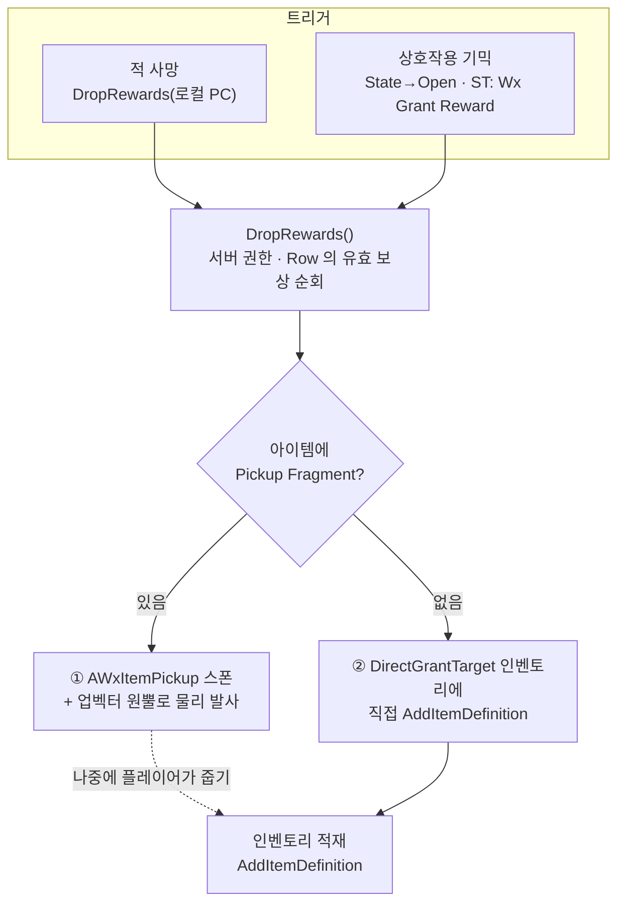
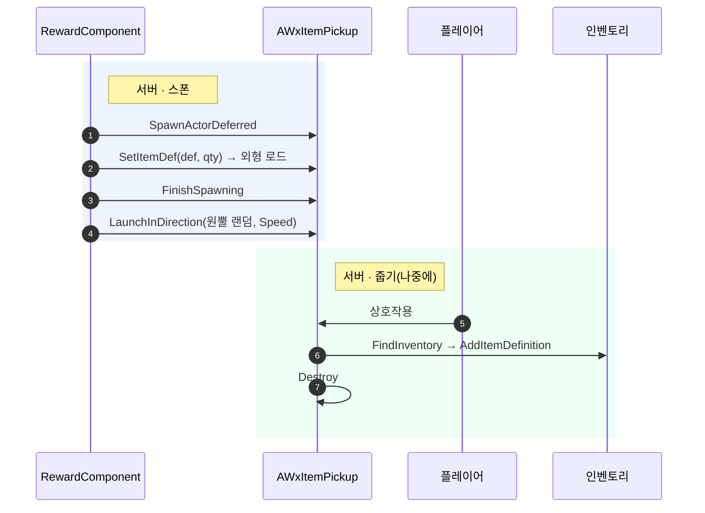
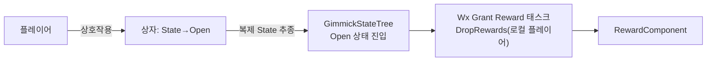

# RewardComponent — 보상 지급 흐름

`UWxRewardComponent` 가 **보상 데이터(DataTable)를 실제 아이템 지급으로 바꾸는** 방식을 정리한다.

---

## 한 문장 요약

> SceneComponent 인 RewardComponent 는, 자신의 월드 위치에서 보상 Row 의 각 아이템을
> **(외형 있으면) 픽업으로 흩뿌리거나 (외형 없으면) 인벤토리에 직접 넣는다.** 서버에서만 동작한다.

두 개의 축만 알면 전부 설명된다.

- **무엇을 하느냐** — 아이템에 `Pickup` Fragment 가 있으면 **픽업 스폰**, 없으면 **직접 지급**
- **언제 하느냐** — **적 사망**(코드가 직접 호출) 또는 **상호작용**(상자 등, StateTree 의 Wx Grant Reward 태스크)

---

## 전체 그림



---

## DropRewards 의 결정

지급의 모든 판단은 `DropRewards(DirectGrantTarget)` 한 곳에서 일어난다.

1. **서버 권한이 아니면 즉시 종료** — 지급은 서버가 결정하고 결과만 복제된다.
2. **`RewardRow` 가 비었으면 종료** — 보상 미지정 오너가 흔해 로그 없이 조용히 끝낸다.
3. Row 의 **유효 보상(아이템 지정 + 수량≥1)** 만 순회한다. 한 Row 에 최대 5개.
4. 각 아이템마다 — `Item` 은 Soft 참조라 **이 시점에 동기 로드**, 그 뒤 Fragment 유무로 분기.

| 분기 | 조건 | 동작 |
| --- | --- | --- |
| **① 픽업 스폰** | `Pickup` Fragment 있음 | 픽업 액터를 Deferred 스폰 → 데이터 주입 → 업 벡터 원뿔로 발사 |
| **② 직접 지급** | `Pickup` Fragment 없음 | `DirectGrantTarget` 인벤토리에 즉시 적재, 대상 없으면 경고 후 스킵 |

> 위치·방향은 **컴포넌트의 월드 배치/회전** 으로 정한다. 위치 = 스폰 지점, 업 벡터(+Z) = 발사 원뿔의 중심축. 에디터에선 화살표로 축이 보인다.

---

## 경로 ① 픽업 스폰 → 줍기

외형 있는 아이템(무기·장비·소비템)은 월드에 흩뿌려지고, 플레이어가 나중에 주워야 인벤토리에 들어간다.



- **Deferred 스폰인 이유** — `BeginPlay` 전에 `ItemDef` 를 주입해야 픽업의 상호작용 텍스트(`[F] 이름 x수량`)가 `BeginPlay` 한 곳에서 갱신된다.
- **흩뿌리기** — 업 벡터 기준 `LaunchConeHalfAngle`(기본 20°) 원뿔 안 랜덤 방향으로 물리 발사. 여러 개가 부채꼴로 퍼진다.
- **외형** — `Pickup` Fragment 의 메시/나이아가라를 로드해 적용. 클라는 `ItemDef` 초기 복제 후 `OnRep` 으로 동일 적용.
- **줍기** — 픽업의 상호작용 컴포넌트도 BP 상속으로 붙고 `IWxInteractionSource` 로 자동 바인딩된다.

---

## 경로 ② 직접 지급

외형 없는 아이템(재화 등)은 띄울 모습이 없으니 **대상 인벤토리에 바로 넣는다.** 대상이 없으면 경고 후 스킵.

직접 지급 대상은 **로컬 플레이어 컨트롤러(`GetPlayerController(0)`)** 다. 적 사망(코드가 직접 호출)·상호작용(Wx Grant Reward 태스크) 양쪽 모두 0번 컨트롤러를 넘긴다.

> 💡 재화처럼 외형 없는 아이템은 `Pickup` Fragment 없이 두면 적 사망·상호작용 양쪽에서 **처치/획득 즉시** 대상 인벤토리에 지급된다. 픽업으로 월드에 흩뿌리고 싶을 때만 `Pickup` Fragment 를 준다.

인벤토리는 PlayerController 에 붙어 있어 `FindInventory` 는 폰 → 컨트롤러를 거쳐 찾는다. 적 사망 경로는 PlayerController 를 바로 넘기므로 폰 경유 없이 찾는다. 대상이 없으면(`nullptr`) 직접 지급은 스킵된다.

---

## 트리거 연동

**적 사망** — `AWxEnemyCharacter` 가 컴포넌트를 직접 소유하고 `HandleDeath`(서버)에서 호출한다.

```cpp
void AWxEnemyCharacter::HandleDeath()
{
    Super::HandleDeath();
    if (!HasAuthority()) { return; }
    // ...
    RewardComponent->DropRewards(UGameplayStatics::GetPlayerController(this, 0));   // 외형 없는 재화는 로컬 플레이어에게 즉시 지급
}
```

**상호작용** — RewardComponent 는 트리거에 직접 바인딩하지 않는다. 상호작용 기믹(보물 상자)은 상호작용 시 자신의 `State` 를 `Open` 으로 확정하고, 이를 추종하는 GimmickStateTree 의 Open 상태에서 `Wx Grant Reward` 태스크가 `DropRewards` 를 호출한다. 비-픽업(재화) 직접 지급은 태스크가 로컬 플레이어(0번 컨트롤러)에게 한다. 1회성 게이팅은 상자의 `State` 가 담당한다.



> 플러그인 간 참조 금지 규칙 때문에 보상 컴포넌트는 C++ 가 아니라 **BP 상속에서 추가** 한다. 태스크는 오너의 `UWxRewardComponent` 를 자동 탐색하고 직접 지급은 로컬 플레이어에게 하므로 ST 에셋에서 바인딩할 것이 없다 — Open 상태에 태스크를 두기만 하면 된다. 태스크는 권위·라이브 진입에서만 지급하므로 복원/조인 시 재지급하지 않는다.

---

## 보상 데이터 작성

`FWxRewardTableRow` DataTable 로 `(아이템, 수량)` 쌍을 **최대 5개** 정의한다. 빈 슬롯은 무시되니 1~5개를 채우면 된다. 컴포넌트의 `RewardRow` 로 이 Row 를 가리키고, 비워두면 아무것도 안 준다.

| 설정 | 위치 | 의미 |
| --- | --- | --- |
| `RewardRow` | 컴포넌트 인스턴스 | 어떤 보상 Row 를 줄지 |
| `LaunchSpeed` / `LaunchConeHalfAngle` | 컴포넌트 기본값 | 픽업 발사 속도 / 퍼짐 각도 |
| 컴포넌트 배치·회전 | 오너 BP | 드랍 위치 / 발사 방향(업 벡터) |

> 같은 `FWxItemRewardEntry` 구조체는 인벤토리 시작 아이템(`DefaultItems`)에도 그대로 재사용된다.

---

## 적재 정책

①·② 모두 `AddItemDefinition` 으로 수렴한다. 적재 방식은 `Stackable` Fragment 가 결정한다.

- **있음(`MaxStack>1`)** — 기존 슬롯에 한도까지 머지, 초과분은 새 슬롯으로 분할.
- **없음** — 항상 1슬롯 = 1개(장비처럼 인스턴스 고유 상태가 있는 아이템).
- 신규 인스턴스 생성 시 각 Fragment 의 `OnInstanceCreated` 호출(예: `Charges` 가 충전량을 가득 채움).

인벤토리는 `FWxInventoryList`(FastArray)로 서버→클라 동기화되어 결과가 UI 에 반영된다.

---

## 주의할 점

- **외형 없는 아이템 + 적 드랍 = 로컬 플레이어 인벤토리에 즉시 지급** (적 사망이 `GetPlayerController(0)` 를 대상으로 넘김). 대상이 없을 때만 스킵.
- **`Pickup` 있는데 `ItemActorClass` 미설정** → 경고 후 스킵 (이 경우엔 직접 지급 폴백 없음).
- **줍는 주체에 인벤토리 없음** → 경고만, 픽업은 파괴되지 않고 남음.
- **반복 지급 방지는 보상 컴포넌트의 책임이 아니다** — 게이팅은 오너(상자의 `State`)가 하고, ST 태스크의 초기진입 가드가 복원/조인 재지급을 막는다.
- `AWxItemPickup`·`AWxTreasureChest` 는 `Abstract` — 실제 사용은 BP 서브클래스.

---

### 참조 코드

| 타입 | 모듈 | 역할 |
| --- | --- | --- |
| `UWxRewardComponent` | WxInventory | 보상 스포너. `DropRewards` 진입점, 분기 결정 |
| `FWxRewardTableRow` / `FWxItemRewardEntry` | WxInventory | 보상 데이터 Row(아이템·수량, 최대 5개) |
| `UWxItemFragment_Pickup` | WxInventory | 픽업 액터 클래스·외형(메시/나이아가라) 정의 |
| `AWxItemPickup` | WxInventory | 월드 픽업 액터. 발사·줍기·인벤토리 지급 |
| `UWxInventoryManagerComponent` | WxInventory | 최종 적재(`AddItemDefinition`)·인벤토리 조회(`FindInventory`) |
| `AWxEnemyCharacter` | WxGame | 적 사망 드랍 호출처(`HandleDeath`) |
| `FWxStateTreeTask_GrantReward` | WxInventory | ST 상태 진입 시 `DropRewards` 호출(권위·라이브 진입 가드). "Wx Grant Reward" |
| `AWxTreasureChest` | WxWorld | 상호작용 트리거 예시(`State` 게이팅) |
| `IWxInteractionSource` | WxCore | 상호작용 연동용 공용 인터페이스 |
