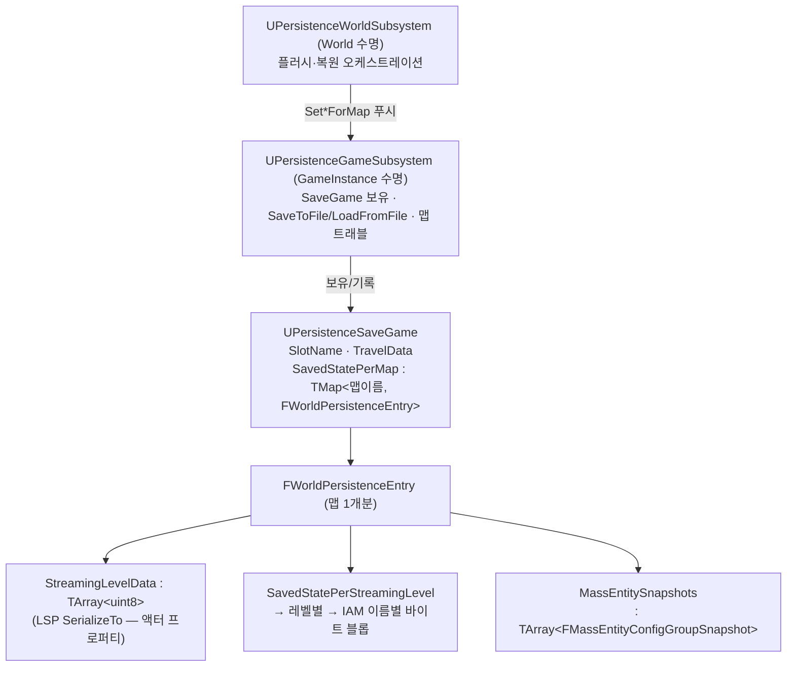
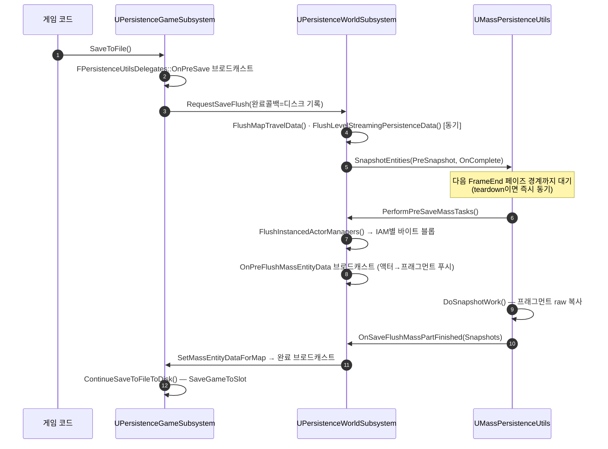

# PersistenceLab 저장 시스템 — 외부 샘플 분석

Unreal Fest 2026 "The Player was Here" 동반 샘플(UE 5.8)의 월드 상태 저장/복원 방식 분석. 대상 루트는 `C:\Sample-PersistenceLab-main`이며, 아래 경로는 모두 그 루트 기준이다. 핵심은 재사용 가능한 `PersistenceUtils` 플러그인이고, `PersistenceExamples` 플러그인은 활용 예제다.

---

## 한 문장 요약

> 단일 `UPersistenceSaveGame` 오브젝트가 **맵 이름을 키로** 월드별 상태를 누적 보관하고, GameInstance 서브시스템이 그 수명·디스크 I/O·맵 트래블을, World 서브시스템이 맵 단위 플러시/복원 오케스트레이션을 맡는다. 저장은 authority 전용(클라이언트 월드에는 서브시스템 자체가 생성 안 됨).

시스템을 가르는 축은 두 개다.

- **데이터 계층(무엇을 어떤 표현으로 저장하나)** — ① 액터 프로퍼티: 엔진 Level Streaming Persistence(LSP) 플러그인이 ini 등록 기반으로 직렬화 / ② Instanced Actors: IAM 단위 버전 헤더 포함 바이트 블롭 / ③ Mass 엔티티: config 에셋별 raw 프래그먼트 스냅샷 / ④ 트래블 데이터: 맵·폰 트랜스폼·컨트롤 로테이션
- **타이밍(언제 만져도 안전한가)** — Mass 프래그먼트를 읽고 쓰는 작업(IAM 직렬화·Mass 스냅샷)은 **FrameEnd 페이즈 경계로 지연**(월드 teardown 시엔 동기 실행) / 나머지(LSP·트래블)는 호출 즉시 동기

---

## 전체 그림

- 맵을 떠날 때 그 맵의 상태가 SaveGame(메모리)에 플러시되고, 다시 들어올 때 자기 맵 엔트리를 찾아 복원한다. 같은 세션 내 맵 왕복만으로도 상태가 유지되며, 디스크 기록은 별도의 명시적 `SaveToFile` 시점에만 일어난다(`bAutoSaveWhenLeavingMap`은 이름과 달리 **메모리 플러시**만 한다).
- PIE에서는 `UPersistenceGameSubsystem::Initialize`가 `PIETestFile` 슬롯을 자동 로드/생성해 반복 테스트를 지원한다.

---

## 저장 흐름

- **페이즈 안전이 흐름의 뼈대다.** IAM 직렬화와 Mass 스냅샷은 둘 다 Mass 프래그먼트를 읽으므로, 프로세서가 도는 중에 실행하면 안 된다. `SnapshotEntities`가 `GetOnProcessingPhaseFinished(EMassProcessingPhase::FrameEnd)`에 작업을 걸어 페이즈 밖 슬롯에서 실행한다. teardown 중이면(그 시점은 이미 프레임 사이) 동기로 돌리고, 스케줄 후 teardown이 끼어들면 teardown 델리게이트가 대신 발화해 저장이 유실되지 않는다(1회 발화 가드 `bFired`).
- **재진입 병합** — 플러시 진행 중 재요청은 `bSaveFlushInProgress`로 걸러지고 완료 콜백만 `OnSaveFlushBroadcast`에 합류한다. 완료 브로드캐스트 직전에 멀티캐스트를 로컬 복사 후 Clear해, 콜백 안에서의 재요청이 유실되지 않는다.
- **teardown 자동 플러시** — `bAutoSaveWhenLeavingMap`이면 `OnWorldBeginTearDown`에서 `RequestSaveFlush`를 콜백 없이 호출한다. 이때 트래블 데이터는 건너뛴다(맵 전환을 일으킨 게임 코드가 다음 시작 지점의 소유자라는 설계). 디스크 기록 없음.

### IAM 블롭의 버전 헤더

`FlushInstancedActorManagerDataForLevel`은 2패스로 쓴다: ① `Manager->Serialize`를 임시 버퍼에 실행해 그 과정에서 쓰인 커스텀 버전 집합을 수집하고, ② `[FPackageFileVersion][FCustomVersionContainer][body]` 순으로 최종 블롭을 조립한다. 복원 시 `RestoreManager`가 헤더를 먼저 읽어 `SetUEVer`/`SetCustomVersions`를 적용한 뒤 body를 역직렬화한다 — 맨 `FMemoryReader`는 커스텀 버전 컨테이너를 현재 빌드 값으로 리셋하므로, 이 헤더가 없으면 `Ar.CustomVer()` 기반 마이그레이션이 전부 무력화된다.

---

## 복원 흐름

복원은 데이터 계층마다 진입 시점이 다르다. 공통 키는 `World->GetOutermost()->GetFName()`(맵)과 `ULevelStreaming::GetWorldAssetPackageFName()`(레벨, PIE 접두사에 안정적).

| 계층 | 시점 | 방법 |
| --- | --- | --- |
| LSP 액터 프로퍼티 | `UPersistenceWorldSubsystem::Initialize` | `ULevelStreamingPersistenceManager::InitializeFrom(bytes)` — 이후 레벨이 보일 때마다 엔진이 알아서 적용 |
| IAM | 등록 후 ~ 엔티티 스폰 전 창 | 아래 상세 |
| Mass 엔티티 | Mass 시뮬레이션 시작 후 | `RestoreEntities` — FrameEnd 경계에서 config 에셋으로 재스폰 + 프래그먼트 바이트 복사 |
| 폰 위치 | `OnWorldInitializedActors` | 저장 트랜스폼에 `APlayerStartPIE` 스폰(기존 것 제거) → GameMode가 거기서 스폰. 컨트롤 로테이션은 `OnWorldBeginPlay`에서 직접 세팅 |

### IAM 복원 창 잡기

IAM 복원은 "IA 서브시스템에 등록된 후(BeginPlay 이후) ~ 지연 엔티티 스폰 전"의 좁은 창에서 실행돼야 한다. 후보를 수집(퍼시스턴트 레벨은 `OnWorldBeginPlay`, 스트리밍 레벨은 `OnLevelBeginMakingVisible`)해 `ManagersPendingRestore`에 넣고, 매 프레임 `OnWorldPreActorTick`(IA 서브시스템의 지연 스폰 틱보다 먼저 실행됨)에서 등록 완료된 것부터 `RestoreManager`로 처리한다. 이 경로는 `IA.DeferSpawnEntities`(기본 on)를 전제하며 `checkf`로 강제한다 — 복원된 데이터의 적용 지점이 스폰 시점(`OnSpawnEntities`)이기 때문이다.

### Mass 스냅샷의 셀프디스크라이빙 스키마

`FMassEntityConfigGroupSnapshot`은 config 에셋 1개당 1개로, `FragmentLayout`(타입 소프트 경로 + 저장 시 바이트 크기 배열)이 `Data`의 스키마 역할을 한다. 복원 시 타입 로드 실패·크기 변경·허용 목록 이탈은 **해당 프래그먼트의 바이트만 소비하고 쓰지 않는 방식**으로 스킵돼 나머지 정렬이 유지된다. 저장 대상 선정은 이중 옵트인이다:

1. **엔티티 옵트인** — config 에셋에 `UPersistableEntityConfigTrait`를 달면 `FPersistableEntityConfigFragment`(출처 config 포인터)가 아키타입에 들어가고, 스냅샷 쿼리가 이 프래그먼트 보유 엔티티만 수집해 config별로 그룹핑한다. 이 프래그먼트 자체는 바이트 직렬화하지 않고(`TObjectPtr`는 세션 간 무의미) `SourceConfigAsset` 소프트 경로로 따로 저장, 복원 후 재스탬프한다.
2. **프래그먼트 허용 목록** — `UPersistenceUtilsSettings::MassFragmentsToSerialize`(ini)에 등록된 타입만 직렬화한다. raw memcpy라서 포인터·핸들이 든 프래그먼트를 걸러내는 안전장치다.

---

## 데이터 계층별 설정 (ini가 절반이다)

LSP 계층은 코드보다 `Config/DefaultEngine.ini`의 `[/Script/LevelStreamingPersistence.LevelStreamingPersistenceSettings]` 섹션이 본체다.

| 설정 | 의미 |
| --- | --- |
| `+Properties=(Path="클래스:프로퍼티",...)` | 이 프로퍼티를 저장 대상으로 등록(C++/BP 클래스 모두 가능). `OuterClassFilter`로 소유자 제한 가능 — 예: `SceneComponent:RelativeLocation`을 Pawn 루트에만 |
| `+RuntimeRespawnedActorClasses=클래스` | 런타임 스폰 액터 중 세이브에 기록하고 다음 로드 때 **재스폰**할 클래스(예: 픽업, NPC, 투사체) |
| `bPersistAllActorDestruction=True` | 맵 배치 액터의 파괴를 기록·재적용 |
| `bIncludePersistentLevel=True` | 퍼시스턴트 레벨도 LSP 대상에 포함 |
| `[/Script/PersistenceUtils.PersistenceUtilsSettings]` | `bAutoSaveWhenLeavingMap` · `bRestorePawnTransform` · `bRestoreControlRotation` · `MassFragmentsToSerialize` |

프로퍼티에 `SaveGame` 지정자를 붙이는 것만으로는 부족하고 ini 등록이 필요하다. 반대로 등록 기반이라 엔진·플러그인 클래스의 프로퍼티도 소스 수정 없이 저장 대상으로 만들 수 있다(예: `PersistedMassSpawner:bHasEverSpawned`).

---

## 크로스 세션 액터 참조

액터 포인터는 세션을 넘지 못하므로, `FPersistableActorReference`가 판별자(`LevelActor`/`PlayerPawn`/`PlayerController`) + 재조회 정보(레벨 경로+액터 FName, 또는 플레이어 인덱스)로 저장한다.

- 해석은 `UPersistableActorReferenceManager`(World 서브시스템)가 맡는다: 레지스트리 조회 → 실패 시 소유 레벨 Actors 배열 FName 스캔 폴백(맵 배치 액터용).
- **런타임 스폰 액터**는 FName이 세션마다 달라지므로 `UPersistableReferencedActorComponent`를 부착한다. `PrePersistObject`에서 이전 세션 정체성(레벨 경로+FName)을 SaveGame 프로퍼티로 캡처하고, `PostRestoreObject`에서 그 정체성으로 매니저에 자기를 등록한다.
- 비동기 해석: `ResolveOrRegister`는 대상 레벨의 LSP `PostRestoreLevel`이 끝난 시점에 pending 콜백을 확정한다(성공=액터, 실패=nullptr). 이 신호는 `FPersistenceUtilsModule::StartupModule`이 LSP 모듈 델리게이트를 매니저로 라우팅해 만든다.
- 활용 예: `UPersistedAbilitySystemComponent`가 GE 인스티게이터를, `APersistenceLabCharacter`가 StateTree의 Patrol/AttackTarget 글로벌 파라미터를 이 참조로 미러링해 저장한다.

---

## 게임 코드 확장점

| 훅 | 시점 | 용도 |
| --- | --- | --- |
| `FPersistenceUtilsDelegates::OnPreSave` | `SaveToFile` 최선두(동기) | 게임 고유 상태를 SaveGame 서브클래스에 푸시 |
| `IPersistedObject::PrePersistObject` / `PostRestoreObject` | LSP 직렬화 직전 / 복원 직후 | 런타임 상태 ↔ `UPROPERTY(SaveGame)` 변환. 모듈 훅이 인터페이스 구현체에 자동 호출 — 별도 등록 불필요 |
| `OnPreFlushMassEntityData` (WorldSubsystem) | 페이즈 밖, 스냅샷 직전 | 액터 권위 상태를 Mass 프래그먼트로 푸시 |
| `UInstancedActorsComponent::SerializeInstancePersistenceData` | IAM Serialize 내부 | 인스턴스별 커스텀 데이터(예제: 비주얼 상태·체력) 직렬화. `UsingCustomVersion`으로 자체 버전 관리 |
| `APersistedMassSpawner::ShouldSpawnEntities` | BeginPlay | `bHasEverSpawned`(LSP로 영속)로 이중 스폰 방지, 오버라이드 가능 |

`PostRestoreObject`는 맵 배치 액터 기준 BeginPlay 전에 온다 — 무거운 반응은 BeginPlay로 미루라는 게 인터페이스 주석의 계약이다.

---

## 예제 계층의 대표 패턴 (PersistenceExamples)

- **deserialize-before-spawn 스테이징** — `UExampleInstancedActorsData`는 로드 시 `SerializeInstancePersistenceData`가 준 비주얼/체력 델타를 `PendingVisualization`/`PendingHealth`에 쌓아 두고, 엔티티가 실제 스폰되는 `OnSpawnEntities`에서 소비한다.
- **lossy GE 스냅샷** — `UPersistedAbilitySystemComponent`는 자산 태그 `Gameplay.Effect.Persistable`가 붙은 활성 GE만 클래스 소프트 경로+남은 시간+스택+SetByCaller로 캡처하고, 복원은 CDO에서 `MakeOutgoingSpec`으로 재조립한다(동적 태그 등은 의도적으로 버림). 재적용은 인스티게이터가 해석 가능해지는 레벨 post-restore 시점으로 지연.
- **IA → 자유 액터 전환** — `UExampleInstancedActorComponent::EjectInstance`는 엔티티 연결을 끊고 인스턴스를 destroyed로 마크해, 이후 그 액터가 LSP 런타임 액터 경로로 넘어가게 한다(파쇄 크레이트가 Chaos에 인계되는 경우). LSP 쪽에서는 `OnShouldPersistRuntimeActor` 훅이 "Mass에 연결된 액터 제외"를 걸어 이중 저장을 막는다.
- **StateTree 상태 저장** — `APersistenceLabCharacter`가 활성 리프 상태 GUID를 `StateTreeStateGuid`로 미러링(LSP 등록)하고, 복원 후 `UPersistedStateTreeComponent::ForceTransitionToState(GUID)`로 강제 진입한다.
- **파쇄 지오메트리** — `UPersistedGeometryCollectionComponent`는 조각별 트랜스폼+파단 인덱스만 저장하고 엔진의 `SetRestState`+`SetInitialClusterBreaks`+`RecreatePhysicsState` 경로로 재생한다(속도는 버림).
- **JSON 대안** — `ATestActorForJson`은 `FJsonObjectConverter::UStructToJsonObjectString` 왕복 데모로, 바이너리 블롭 대신 구조체→JSON 문자열을 세이브 레코드로 쓰는 선택지를 보여 준다.

---

## WxSave 설계 관점 메모

- **맵 이름 키의 SaveGame 누적 + "맵 이탈 시 메모리 플러시, 디스크는 명시적"** 분리는 그대로 가져갈 만한 골격이다. 세이브 파일 1개로 멀티 맵 상태가 자연히 유지된다.
- **바이트 블롭에는 반드시 버전 헤더** — `[FPackageFileVersion][FCustomVersionContainer][body]` 패턴은 `FMemoryReader`의 버전 리셋 함정을 막는 최소 비용 장치다.
- **옵트인 마커(trait/태그/ini 허용 목록)로 저장 대상을 명시** — "기본 저장 안 함 + 명시 등록"이 raw 직렬화의 안전 전제다.
- **복원 시점을 시스템별 수명 이벤트에 정렬** — LSP는 Initialize, IAM은 pre-tick 폴링 창, Mass는 시뮬레이션 시작 후, 폰은 actors-initialized. "언제 적용해도 되는가"를 먼저 정의하는 접근이 유효하다.
- 저자 주의: README에 "출시 타이틀에서 검증되지 않은 예제 코드"라고 명시돼 있다. LSP는 UE 5.3+, Instanced Actors는 UE 5.4+ experimental.

---

### 참조 코드

경로는 `C:\Sample-PersistenceLab-main` 기준.

| 타입 | 위치 | 역할 |
| --- | --- | --- |
| `UPersistenceSaveGame` / `FWorldPersistenceEntry` | `Plugins/PersistenceUtils/Source/PersistenceUtils/Public/Data/` | 세이브 데이터 컨테이너(맵별 키잉) |
| `UPersistenceGameSubsystem` | `Plugins/PersistenceUtils/.../Framework/PersistenceGameSubsystem.h/.cpp` | SaveGame 수명·디스크 I/O·트래블 |
| `UPersistenceWorldSubsystem` | `Plugins/PersistenceUtils/.../Framework/PersistenceWorldSubsystem.h/.cpp` | 플러시/복원 오케스트레이션, IAM 블롭·복원 창 |
| `UMassPersistenceUtils` | `Plugins/PersistenceUtils/.../MassPersistence/MassPersistenceUtils.h/.cpp` | Mass 스냅샷/복원, FrameEnd 지연 + teardown 페일세이프 |
| `UPersistableEntityConfigTrait` | `Plugins/PersistenceUtils/.../MassPersistence/PersistableEntityConfigTrait.h` | Mass 퍼시스턴스 옵트인 + 출처 config 스탬프 |
| `APersistedMassSpawner` | `Plugins/PersistenceUtils/.../MassPersistence/PersistedMassSpawner.h` | 이중 스폰 방지 스포너 |
| `FPersistableActorReference` / `UPersistableActorReferenceManager` / `UPersistableReferencedActorComponent` | `Plugins/PersistenceUtils/.../References/` | 크로스 세션 액터 참조 |
| `FPersistenceUtilsModule` | `Plugins/PersistenceUtils/.../Private/PersistenceUtils.cpp` | LSP 모듈 훅 배선(IPersistedObject 자동 호출, Mass 소유 액터 제외 등) |
| `UPersistenceUtilsSettings` | `Plugins/PersistenceUtils/.../Public/PersistenceUtilsSettings.h` + `Config/DefaultEngine.ini` | 플러그인 설정·Mass 프래그먼트 허용 목록 |
| `UExampleInstancedActorComponent` / `UExampleInstancedActorsData` | `Plugins/PersistenceExamples/.../InstancedActors/` | IA 커스텀 직렬화·스테이징 예제 |
| `UPersistedAbilitySystemComponent` | `Plugins/PersistenceExamples/.../GAS/PersistedAbilitySystemComponent.h` | GE 스냅샷 예제 |
| `UPersistedGeometryCollectionComponent` | `Plugins/PersistenceExamples/.../GeometryCollection/` | 파쇄 상태 저장 예제 |
| `UPersistedStateTreeComponent` / `APersistenceLabCharacter` | `Plugins/PersistenceExamples/.../AI/` · `Source/PersistenceLab/` | StateTree GUID 저장 예제 |
