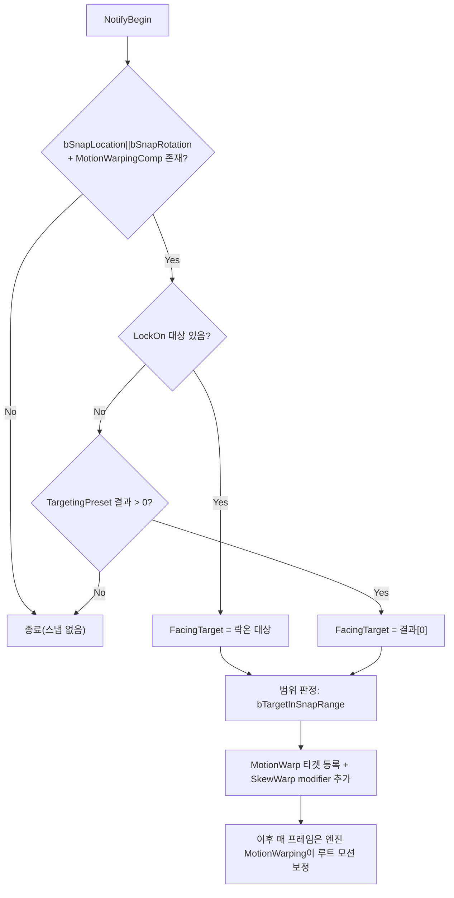

# SnapToTarget — 몽타주 중 타겟 정렬(모션 워핑) 메커니즘

공격/스킬 몽타주 재생 중 캐릭터를 타겟 쪽으로 이동·회전시켜 정렬하는 `UWxAnimNotifyState_SnapToTarget`의 동작을 다룬다.

---

## 한 문장 요약

> 몽타주에 배치된 `UWxAnimNotifyState_SnapToTarget`이 `NotifyBegin` 한 시점에 타겟을 정하고, 엔진의 `UMotionWarpingComponent`에 `SkewWarp` 루트 모션 modifier를 등록해 두면 — 이후 매 프레임 보정은 엔진 모션 워핑이 수행한다. NotifyState 자체는 Tick/End 콜백을 쓰지 않는다.

이 시스템을 가르는 축.

- **타겟 소스** — 락온 대상(우선) / `TargetingPreset` 쿼리 첫 결과(폴백)
- **스냅 종류** — 위치 스냅(`bSnapLocation`, 타겟팅 범위 안일 때만) / 회전 스냅(`bSnapRotation`, 거리 무관)

---

## 전체 그림

---

## 핵심 로직 — `NotifyBegin`

모든 처리가 `NotifyBegin` 한 번에 모인다. NotifyTick/NotifyEnd는 오버라이드하지 않으며, 시간축 보간은 등록된 modifier로 엔진에 위임된다.

1. `MeshComp` 유효성, `bSnapLocation || bSnapRotation` 둘 다 false면 조기 종료.
2. `MeshComp->GetOwner()`로 소유 액터 환원 → `FindComponentByClass<UMotionWarpingComponent>()` 없으면 종료.
3. **타겟 결정**: `UWxLockOnManagerComponent::FindComponent(Owner)`로 락온 컴포넌트를 찾고, `GetLockOnTarget()`(SceneComponent) → `GetOwner()`로 락온 대상 액터를 얻는다.
4. **폴백/범위 판정**: `TargetingPreset`이 있으면 `UTargetingSubsystem`로 쿼리를 실행해 결과 배열을 받는다. `FacingTarget`은 (락온 대상) 우선, 없으면 결과 `[0]`.
5. 타겟 없거나 방향 벡터(Z 제거)가 영벡터면 종료.
6. 워프 타겟 등록 + `SkewWarp` modifier 추가(아래 상세).

| 분기 | 조건 | 동작 |
| --- | --- | --- |
| **위치+회전 스냅** | `bSnapLocation` && `bTargetInSnapRange` | `MinDistance` 앞까지 접근 + 타겟 방향 회전 |
| **회전만** | 위 조건 불충족 (범위 밖 등) | 이동 생략, 회전만 적용 |

> `bTargetInSnapRange = !TargetingPreset || TargetingResults.Contains(FacingTarget)`. 즉 **`TargetingPreset`이 비어 있으면 판정 근거가 없으므로 위치 스냅을 기본 허용**한다. Preset이 있을 때만 "타겟이 쿼리 결과에 포함되는가"로 범위를 체크하며, 락온 대상이라도 결과에 없으면 회전만 적용된다.

---

## 워프 등록 상세

`AddOrUpdateWarpTargetFromLocationAndRotation`으로 워프 타겟(`"SnapToTarget"`)을 먼저 등록한다.

- `WarpLocation = OwnerLocation + DirNorm * max(0, CurrentDistance - MinDistance)` — 타겟 정면 `MinDistance` 지점에서 멈춘다(타겟 위로 겹치지 않음).
- `WarpRotation = Direction.Rotation()` — 타겟을 바라보는 yaw.

이어 `URootMotionModifier_SkewWarp::AddRootMotionModifierSkewWarp`를 **두 번** 등록한다.

| modifier | 구간 | 역할 |
| --- | --- | --- |
| **메인** | `NotifyEvent` 트리거~종료 시각 | 실제 스냅. translation은 `bShouldWarpTranslation`, rotation은 `bSnapRotation`으로 게이팅 |
| **테일(hold)** | Notify 종료~`Animation->GetPlayLength()` | 위치 스냅일 때만. 종료 후 잔여 forward 루트 모션이 타겟 너머로 밀지 않도록 같은 `WarpLocation`에 다시 워프를 걸어 잔여 트랜슬레이션을 0으로 스케일 |

> **회전은 `EMotionWarpRotationType::Default`(캡처값 그대로)** 를 쓴다 — `Facing` 모드는 캐릭터가 `WarpLocation`에 가까워지면 2D 방향 벡터가 0에 수렴해 정규화가 실패, 회전이 튄다(근거리 콤보에서 프레임 단위로 노출). `Default`로 이 축퇴를 회피한다.

---

## 모듈 경계

- **NotifyState는 `WxCombat`**, 정렬 대상이 되는 캐릭터는 `WxGame`(`AWxCharacterBase`). 플러그인은 게임 모듈을 참조할 수 없으므로, NotifyState는 **구체 캐릭터 타입을 보지 않는다.**
- 우회 경로: `MeshComp->GetOwner()`(엔진 `AActor`) → `FindComponentByClass<UMotionWarpingComponent>()`(엔진 `MotionWarping` 플러그인 타입). 즉 **엔진 타입과 컴포넌트 조회만으로 게임 모듈 의존을 피한다.**
- `UMotionWarpingComponent`는 `AWxCharacterBase`가 생성자에서 `CreateDefaultSubobject`로 보유한다(게임 모듈 측 책임).
- 타겟 결정은 같은 `WxCombat` 내부의 `UWxLockOnManagerComponent`와 엔진 `TargetingSystem` 플러그인(`UTargetingSubsystem`, `UTargetingPreset`)을 사용한다.

---

## 데이터 / 설정

NotifyState 인스턴스(몽타주에 배치된 Notify)에서 설정한다.

| 프로퍼티 | 기본값 | 의미 |
| --- | --- | --- |
| `TargetingPreset` | null | 스냅 범위/폴백 타겟 판정용 타겟팅 프리셋. 비우면 위치 스냅 기본 허용 |
| `bSnapLocation` | `false` | 타겟 쪽으로 접근(`MinDistance` 앞 정지). 범위 안일 때만 |
| `bSnapRotation` | `true` | 타겟 방향 회전. 거리 무관 |
| `MinDistance` | `150.0` | 타겟 앞에서 멈출 거리(`bSnapLocation` 시) |

---

## 주의할 점

- **NotifyState의 길이 = 워프 구간.** `NotifyEvent->GetTriggerTime()`~`GetEndTriggerTime()`이 메인 modifier 구간이다. 몽타주에서 Notify를 어디에 얼마나 길게 배치하느냐가 스냅 타이밍/세기를 결정한다.
- **`TargetingPreset`을 비우면 범위 체크가 사라진다** — 위치 스냅이 무조건 허용되니, "범위 안일 때만 끌어당김"을 원하면 반드시 Preset을 지정해야 한다.
- **타겟 본/소켓이 아니라 액터 위치 기준.** 락온은 SceneComponent 단위지만 스냅은 `FacingTarget->GetActorLocation()`(액터 위치)으로 계산한다.
- **책임 경계**: NotifyState는 modifier 등록까지만. 이후 위치/회전 보간·CMC 루트 모션 적용은 엔진 `UMotionWarpingComponent`/`URootMotionModifier_SkewWarp`가 수행한다.

---

## 네트워크 *(부분 검증)*

- **락온 대상은 서버 권위 복제**된다(`UWxLockOnManagerComponent::LockOnTarget`이 `ReplicatedUsing`). 따라서 서버·시뮬프록시 등 모든 소비처가 같은 스냅 타겟을 읽는다.
- `NotifyBegin`은 몽타주가 재생되는 각 머신에서 로컬로 실행되어 자기 `UMotionWarpingComponent`에 modifier를 등록한다(루트 모션 보정은 CMC와 함께 로컬에서 적용). 별도 RPC/복제는 NotifyState에 없다.

---

### 참조 코드

| 타입 | 모듈 | 역할 |
| --- | --- | --- |
| `UWxAnimNotifyState_SnapToTarget` | `Plugins/WxCombat/Source/WxCombat/Private/AnimNotify/WxAnimNotifyState_SnapToTarget.cpp` | 본체. `NotifyBegin`에서 타겟 결정 + 워프 등록 |
| `UWxLockOnManagerComponent` | `Plugins/WxCombat/Source/WxCombat/Public/Targeting/WxLockOnManagerComponent.h` | 락온 대상(우선 타겟) 제공·복제 |
| `UMotionWarpingComponent` | 엔진 `MotionWarping` 플러그인 | 워프 타겟 보유, 루트 모션 보정 실행 주체 |
| `URootMotionModifier_SkewWarp` | 엔진 `MotionWarping` 플러그인 | 등록되는 스냅 modifier(메인+테일) |
| `UTargetingSubsystem` / `UTargetingPreset` | 엔진 `TargetingSystem` 플러그인 | 스냅 범위/폴백 타겟 쿼리 |
| `AWxCharacterBase` | `Source/WxGame/Character/WxCharacterBase.cpp` | `UMotionWarpingComponent`를 디폴트 서브오브젝트로 보유 |
