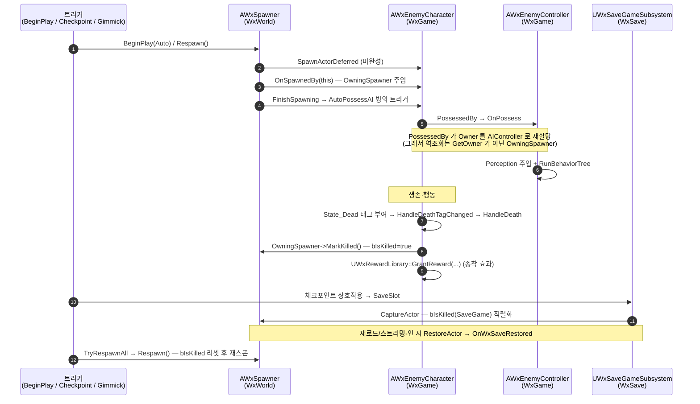

# Spawner → Enemy Lifecycle — 스폰부터 사망·영속·리스폰까지의 전체 흐름

`AWxSpawner` 가 적을 스폰해 AI 가 빙의하고, 적이 사망하며 부작용(처치 마킹·보상 드랍)을 일으키고, 처치 상태가 `WxSave` 슬롯에 영속되어 체크포인트에서 일괄 리스폰되기까지의 라이프사이클을 모듈 경계를 넘어 추적한다.

---

## 한 문장 요약

> `AWxSpawner`(WxWorld)는 `SpawnableActorClass` 인스턴스를 스폰하고, 스폰된 적(`AWxEnemyCharacter`, WxGame)은 `IWxSpawnableInterface::OnSpawnedBy` 로 자신을 만든 스포너의 백레퍼런스를 보유한다. 적 사망 시 그 백레퍼런스로 스포너에 처치를 마킹하고, 처치 상태(`bIsKilled`)는 `WxSave` 슬롯에 영속되며, 체크포인트 상호작용 시 일괄 리스폰된다. **스폰/Respawn/MarkKilled/HandleDeath 의 모든 부작용은 `HasAuthority()` 로 게이팅되어 클라이언트 경로는 no-op 이다.**

이 라이프사이클을 가르는 두 축:

- **트리거 종류** — Auto(BeginPlay 자동) / Manual(외부 트리거 전용) / 체크포인트 일괄 리스폰(`TryRespawnAll`) / 기믹 명시 리스폰(`TriggerSpawners`)
- **라이프사이클 단계** — 스폰(Deferred + 컨텍스트 주입) → 빙의 → 생존 → 사망(부작용) → 영속(`bIsKilled`) → 리스폰

---

## 전체 그림

라이프사이클 전체를 한 장의 시퀀스로. 모든 서버 권위 단계는 `HasAuthority()` 게이트를 통과한 경우만 그려졌다.

---

## 핵심 로직: 스폰과 역조회 링크

스폰의 핵심은 `AWxSpawner::SpawnTarget()` 의 **Deferred Spawn 3단 순서**와, 그것이 가능케 하는 **양방향 weak 백레퍼런스**다.

1. `SpawnActorDeferred<AActor>(...)` 로 미완성 액터 생성 — 아직 `BeginPlay`/빙의 전.
2. `Cast<IWxSpawnableInterface>(Spawned)->OnSpawnedBy(this)` 로 per-instance 컨텍스트 주입.
3. `FinishSpawning(SpawnTransform)` — 이 시점에 `AutoPossessAI` 빙의가 일어난다.

> **왜 Deferred 인가** — 일반 `SpawnActor` 는 호출 내부에서 빙의까지 끝내므로, 그 뒤에 컨텍스트를 심으면 컨트롤러 `OnPossess`/`BeginPlay` 가 이미 컨텍스트 없이 실행된 뒤다. Deferred 로 `FinishSpawning` 직전에 `OnSpawnedBy` 를 끼워 넣어야 빙의 전에 컨텍스트가 보장된다(`WxSpawnableInterface.h` 주석 참조).

역조회(적 → 스포너) 설계는 다음 표로 갈린다.

| 링크 | 방향 | 타입 | keep-alive |
| --- | --- | --- | --- |
| `OwningSpawner` | 적 → 스포너 | `TWeakObjectPtr<AWxSpawner>` (WxGame 측) | 안 함 |
| `SpawnedActor` | 스포너 → 적 | `TWeakObjectPtr<AActor>` (WxWorld 측) | 안 함 |

> **왜 `GetOwner()` 가 아닌가** — `SpawnActorDeferred` 의 Owner 인자로 스포너를 넘기지만, `APawn::PossessedBy` 가 빙의 시 Owner 를 AIController 로 재할당한다. 따라서 사망 시점에 `GetOwner()` 는 더 이상 스포너가 아니다. 과거의 전수 순회(레지스트리 서브시스템) 대신 `OnSpawnedBy` 로 심은 백레퍼런스로 O(1) 역조회한다. 양쪽 다 weak 이라 서로를 keep-alive 하지 않는 대칭 구조다(어느 쪽이 먼저 파괴돼도 dangling 없음).

---

## 단계별 상세

### 빙의 (AWxEnemyController::OnPossess)

`AWxEnemyCharacter` 생성자가 `AIControllerClass = AWxEnemyController`, `AutoPossessAI = PlacedInWorldOrSpawned` 를 설정하므로 `FinishSpawning` 이 빙의를 트리거한다. `OnPossess` 는 적의 per-class 데이터를 AI 시스템에 주입한다.

- `ApplySenseSettings(SightRadius, SightAngle, MaxHearingRange)` — 적의 시야/청각 값을 `UWxAIPerceptionComponent` 에 주입.
- `RunBehaviorTree(Enemy->GetBehaviorTree())` 를 **먼저** 호출한 뒤 Blackboard 키(`SelfActor`, `HomeLocation`)를 세팅 — Blackboard 컴포넌트가 `RunBehaviorTree` 내부에서 생성되므로 순서가 반대면 키 세팅이 통째로 누락된다.

### 사망 경로 (HandleDeath)

사망은 GAS 태그로 트리거된다. `AWxCharacterBase::InitAbilitySystem` 이 `State_Dead`(`WxGameplayTags::State_Dead`) 태그 이벤트를 구독하고, 태그가 부여되면 `HandleDeathTagChanged(NewCount > 0)` → `HandleDeath()` 가 불린다.

- 베이스 `AWxCharacterBase::HandleDeath()` 는 `OnDeath` 델리게이트만 방송한다.
- 오버라이드 `AWxEnemyCharacter::HandleDeath()` 는 `Super::HandleDeath()` 후 `HasAuthority()` 게이트 안에서 두 부작용을 실행한다:
  1. `OwningSpawner.Get()->MarkKilled()` — 스포너에 처치 마킹(직접 배치된 적은 `OwningSpawner` 가 비어 있어 스킵).
  2. `UWxRewardLibrary::GrantReward(this, RewardRow, ...)` — 라이프사이클의 **종착 효과**. BFL(WxInventory)이 외형 없는 재화는 인벤토리에 즉시 지급, 외형 있는 보상은 픽업으로 스폰해 수직 발사한다. (보상 시스템 자체는 본 문서 범위 밖.)

---

## 영속: bIsKilled 와 WxSave

`bIsKilled` 는 `UPROPERTY(SaveGame)` 로, `MarkKilled()` 가 서버에서 `true` 로 세팅한다. 영속·복원은 `IWxSavable` 계약(WxCore 정의)을 통해 `UWxSaveGameSubsystem`(WxSave)이 처리한다.

- **키** — `GetWxSaveId()` 가 반환하는 `WxSaveId`. 에디터에서 `PostActorCreated`/`PostDuplicate` 가 `GetActorGuid()` 를 복사해 에셋에 직렬화하므로 쿠킹 빌드/세션 간 불변이다(런타임에선 `GetActorGuid()` 가 에디터 전용이라 못 씀).
- **캡처** — `CaptureActor` 가 `ArIsSaveGame=true` 아카이브로 `bIsKilled` 를 `FWxActorRecord.ByteData` 에 직렬화. 호출 시점은 ① `SaveSlot`(체크포인트), ② `LevelRemovedFromWorld`(스트리밍-아웃).
- **복원** — `RestoreActor` 가 레코드를 역직렬화한 뒤 `OnWxSaveRestored()` 를 호출. 호출 시점은 ① `OnWorldInitializedActors`(영구 레벨/초기 셀), ② `LevelAddedToWorld`(스트리밍-인).

**복원 타이밍이 두 갈래라는 점이 `OnWxSaveRestored` 설계를 좌우한다:**

| 복원 시점 | BeginPlay 와의 순서 | 문제 | `OnWxSaveRestored` 의 역할 |
| --- | --- | --- | --- |
| 초기 로드 (`OnWorldInitializedActors`) | **BeginPlay 이전** | `bIsKilled=true` 가 BeginPlay 전에 들어와, BeginPlay 의 가드(`if (bIsKilled) return;`)가 자동 스폰을 막음 | 추가 정리 불필요 |
| 스트리밍-인 (`LevelAddedToWorld`) | **BeginPlay 이후** | BeginPlay 가 이미 인스턴스를 스폰한 뒤 `bIsKilled=true` 가 적용됨 | 이미 스폰된 `SpawnedActor` 를 `Destroy()` 로 정리 |

> 즉 `OnWxSaveRestored` 는 "BeginPlay 가 먼저 달려서 시체(살아있는 인스턴스)를 만들어 버린 경우"의 사후 청소를 담당한다. BeginPlay 의 `if (bIsKilled) return;` 가드는 초기 로드 경로용 + 에디터 디폴트로 `true` 가 들어오는 경우의 안전망이다.

---

## 리스폰 의미론

리스폰 진입점은 둘이며, 모두 결국 `AWxSpawner::Respawn()` 을 호출한다.

| 트리거 | 진입점 | 대상 선정 | Manual 처리 |
| --- | --- | --- | --- |
| 체크포인트 일괄 | `UWxSpawnerLibrary::TryRespawnAll` (BP 라이브러리) | `TActorIterator<AWxSpawner>` 로 월드 전수 수집 | **제외** |
| 기믹 명시 | `FWxStateTreeTask_TriggerSpawners::EnterState` | 디자이너가 지정한 `TSoftObjectPtr<AWxSpawner>` 명시 리스트 | 리스트에 넣으면 트리거됨 |

`Respawn()` 의 의미론(`HasAuthority()` 게이트 안):

1. 기존 `SpawnedActor` 가 있으면 `Destroy()`(시체 청소 + 살아있으면 위치/상태 원복용).
2. `bIsKilled && bNeverRevive` 이면 **여기서 종료** — 보스 등 영구 처치 대상은 부활하지 않는다.
3. 그 외엔 `bIsKilled=false` 로 리셋 후 `SpawnTarget()` 재호출.

> **`bNeverRevive`** — `EditCondition = "SpawnMode == Auto"` 라 Manual 모드에선 비활성화된다. 살아있을 땐 일반 대상처럼 리셋되고, 죽은 뒤에만 부활이 막힌다.
>
> **collect-first 의 이유** — `TryRespawnAll` 은 스포너를 배열에 먼저 모은 뒤 순회를 끝내고 일괄 호출한다. `Respawn()` 이 루프 안에서 액터를 `Destroy`/`Spawn` 하는데, 그러면 `TActorIterator` 가 가리키는 월드 액터 배열이 순회 중 변경되어 무효화되기 때문이다.

체크포인트 상호작용(`AWxCheckPoint::HandleInteracted`, `HasAuthority()` 게이트)의 **호출 순서**:

1. `SetPlayerStartTag(PlayerStartTag)` — 부활 지점 등록(메모리).
2. `HealEffect` 적용 + 인벤토리 `RefillItemCharges` — 힐/충전 리필.
3. `TryRespawnAll(this)` — 일괄 리스폰.
4. `SaveSlot("Test")` — 갱신된 PlayerStartTag + 리셋된 월드 상태를 디스크에 영속. **반드시 마지막** — `SetPlayerStartTag` 이후라 순서가 보장된다.

---

## 모듈 경계와 의존 방향

플러그인 규칙상 **WxWorld 는 WxGame 을 참조할 수 없다.** 그래서 "적이 스포너를 안다"는 링크는 다음 방식으로만 성립한다.

- 인터페이스 `IWxSpawnableInterface` 는 **WxWorld 가 정의**한다(`OnSpawnedBy` 훅). 단, WxCore 가 아니라 WxWorld 에 둔 점에 주의 — 스포너 도메인 내부 계약이라서다.
- 적 `AWxEnemyCharacter`(WxGame)가 그 인터페이스를 **구현**한다. WxGame → WxWorld 의존은 허용되므로 적이 `AWxSpawner*` 를 직접 들 수 있다.
- 역방향 백레퍼런스 `OwningSpawner` 는 **WxGame 쪽에만** 존재한다. WxWorld 는 어떤 적 타입도 모른 채 `IWxSpawnableInterface*` 로만 다룬다.
- `IWxSavable` 계약은 WxCore 에 둬서 WxSave 와 소비 도메인(WxWorld)이 서로 직접 의존하지 않게 한다.

> 이 제약이 "인터페이스는 도메인이 정의, 백레퍼런스는 게임 모듈이 보유"라는 연동 형태를 **강제**했다. 의존 방향이 한쪽으로만(WxGame → WxWorld → WxCore) 흐른다.

---

## 주의할 점

- **클라이언트 경로는 전부 no-op** — `SpawnTarget`/`Respawn`/`MarkKilled`/`HandleDeath` 부작용/`TriggerSpawners`/`TryRespawnAll`(스포너 내부) 모두 `HasAuthority()` 게이트. 클라는 복제로만 결과를 받는다.
- **`OwningSpawner` 가 비어 있을 수 있다** — 직접 레벨에 배치된 적(스포너를 거치지 않음)은 `OnSpawnedBy` 가 안 불려 `MarkKilled()` 가 스킵된다. 이는 정상이다.
- **역조회에 `GetOwner()` 금지** — 빙의가 Owner 를 AIController 로 갈아치우므로 반드시 `OwningSpawner` 를 쓴다.
- **스트리밍-아웃된 스포너는 강제 로드 안 함** — `TriggerSpawners` 는 `SoftSpawner.Get()` 이 null 이면 스킵한다. 디자이너가 트리거 기믹과 스포너를 같은 WP 영역에 배치해야 한다.
- **종착 효과(보상)는 본 문서 범위 밖** — `GrantReward` 호출까지가 라이프사이클이고, 보상 분배 로직은 `UWxRewardLibrary`(WxInventory)의 책임이다.

---

### 참조 코드

| 타입 | 모듈 | 역할 |
| --- | --- | --- |
| [`AWxSpawner`](../../Plugins/WxWorld/Source/WxWorld/Public/Spawnable/WxSpawner.h) | WxWorld | 스폰/Respawn/MarkKilled/bIsKilled 보유, IWxSavable 구현 |
| [`AWxSpawner` (cpp)](../../Plugins/WxWorld/Source/WxWorld/Private/Spawnable/WxSpawner.cpp) | WxWorld | SpawnTarget(Deferred 3단), Respawn 의미론, OnWxSaveRestored 정리 |
| [`IWxSpawnableInterface`](../../Plugins/WxWorld/Source/WxWorld/Public/Spawnable/WxSpawnableInterface.h) | WxWorld | OnSpawnedBy 컨텍스트 주입 훅(도메인이 정의) |
| [`UWxSpawnerLibrary`](../../Plugins/WxWorld/Source/WxWorld/Public/System/WxSpawnerLibrary.h) | WxWorld | TryRespawnAll — collect-first 일괄 리스폰(Manual 제외) |
| [`FWxStateTreeTask_TriggerSpawners`](../../Plugins/WxWorld/Source/WxWorld/Private/Gimmick/WxGimmickStateTreeNodes.cpp) | WxWorld | 명시 리스트 기반 기믹 리스폰(약 537행~) |
| [`AWxEnemyCharacter`](../../Source/WxGame/Character/WxEnemyCharacter.h) | WxGame | IWxSpawnableInterface 구현, OwningSpawner 보유, HandleDeath 부작용 |
| [`AWxCharacterBase`](../../Source/WxGame/Character/WxCharacterBase.cpp) | WxGame | State_Dead 태그 → HandleDeathTagChanged → HandleDeath 경로 |
| [`AWxEnemyController`](../../Source/WxGame/Controller/WxEnemyController.cpp) | WxGame | OnPossess — Perception 주입 + RunBehaviorTree |
| [`AWxCheckPoint`](../../Source/WxGame/WorldObject/WxCheckPoint.cpp) | WxGame | HandleInteracted — 힐/리필 → TryRespawnAll → SaveSlot 순서 |
| [`IWxSavable`](../../Plugins/WxCore/Source/WxCore/Public/WxSavable.h) | WxCore | 저장/복원 계약(GetWxSaveId/OnWxSaveRestored) |
| [`UWxSaveGameSubsystem`](../../Plugins/WxSave/Source/WxSave/Private/WxSaveGameSubsystem.cpp) | WxSave | CaptureActor/RestoreActor, World/Level 훅으로 자동 캡처·복원 |
| [`FWxActorRecord`](../../Plugins/WxSave/Source/WxSave/Public/WxSaveGame.h) | WxSave | bIsKilled(SaveGame) 직렬화 레코드 |
| [`UWxRewardLibrary`](../../Plugins/WxInventory/Source/WxInventory/Public/WxRewardLibrary.h) | WxInventory | GrantReward — 라이프사이클 종착 효과(범위 밖) |
| `WxGameplayTags::State_Dead` | WxCore | 사망 트리거 태그 |
