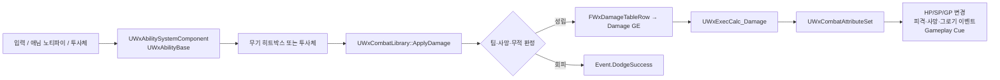

<!--
시스템/컴포넌트 분석 문서 템플릿.
이 파일을 복사해 `<주제>.md` 로 만들고, <...> 자리와 안내 주석을 채우거나 지운다.
필요 없는 섹션은 통째로 지운다 — 모든 섹션이 모든 분석에 필요하진 않다.

작성 원칙
- 넓게 → 좁게: 한 문장 요약 → 전체 그림 → 분기/경로별 상세 → 디테일.
- "축"을 먼저 잡는다. 시스템을 가르는 1~2개의 결정 축을 앞에 박으면 나머지가 그 위에 얹힌다.
- 다이어그램·표는 설명을 대신할 때만. 산문으로 충분하면 만들지 않는다.
- 중복 금지: 같은 내용을 요약·표·산문에서 반복하지 않는다.
- 코드 근거는 짧게. 핵심 함수/조건만, 파일 경로는 맨 끝 "참조 코드"에 모은다.
-->

# WxCombat — GAS 기반 전투 플러그인 개요

`WxCombat` 런타임 플러그인이 입력·무기 적중·피해 효과·락온·시간 연출을 GAS를 중심으로 연결하는 구조를 다룬다.

---

## 한 문장 요약

> 캐릭터와 공격 수단이 만든 입력·애님·충돌 트리거를 GAS 스펙으로 수렴시키고, 실제 수치 변경 뒤에 피격 반응·사망·큐를 발행하는 전투 도메인 플러그인이다.

- **진입점** — 플레이어 입력은 `UWxAbilitySystemComponent`, 근접 공격은 `UWxAnimNotifyState_WeaponAttack`, 원거리는 `AWxProjectileBase`가 맡는다.
- **확정 지점** — `UWxExecCalc_Damage`는 결과를 계산만 하고, `UWxCombatAttributeSet::PostGameplayEffectExecute`가 HP·이벤트·피드백으로 옮긴다.

---

## 전체 그림

`WxCombat`은 `WxCore`만 직접 참조하는 도메인 플러그인이다. 게임 모듈은 캐릭터에 ASC와 AttributeSet을 소유하고, 다른 도메인은 공통 GAS 계약(태그, GE, ASC)을 통해 연결한다. 예를 들어 `WxAI`는 `WxCombat` 타입을 참조하지 않고, 저작자가 지정한 이동 속도 GE를 일반 ASC에 적용한다.

---

## Ability System과 입력

`AWxCharacterBase`는 `UWxAbilitySystemComponent`와 `UWxCombatAttributeSet`을 생성한다. 서버의 `InitAbilitySystem`은 `UWxAbilitySet`에서 초기 어트리뷰트, 어빌리티, 효과를 한 번만 부여하며 클라이언트는 이를 복제받는다. 플레이어 캐릭터는 AbilitySet에 포함된 각 `UInputAction`을 ASC의 입력 함수에 바인딩한다.

`UWxAbilitySystemComponent`는 같은 입력에 맞는 `UWxAbilityBase` 발동을 시도하고, 활성 어빌리티에는 누름/해제 이벤트도 전달한다. 배타 활성 그룹에 막힌 탭은 실시간 기준 `InputBufferDuration` 동안 보관하며, `UWxAbilityBase`가 콤보 창 또는 후딜을 열 때 `FlushBufferedInputs`로 재시도한다. `Reaction`은 배타 동작과 공존하고, 일반 동작은 활성 그룹 및 취소 태그로 서로의 발동을 제한한다.

---

## 적중부터 피해·피드백까지

`UWxCombatLibrary::ApplyDamage`가 모든 피해 경로의 단일 진입점이다. 공격자·피격자의 ASC를 얻고 `FWxDamageTableRow`로부터 Damage GE와 추가 효과 스펙을 만든다. 이때 행의 공격 계수, 피격 반응 태그, 가드·크리·패리 허용 여부가 스펙 태그와 SetByCaller 값으로 실린다.

| 분기 | 조건 | 결과 |
| --- | --- | --- |
| **무효** | 대상 없음, 사망, 비적대 관계 | GE를 적용하지 않는다. |
| **회피** | 대상에 `Effect.Invincible` | `Event.DodgeSuccess`만 발행하고 GE를 적용하지 않는다. |
| **퍼펙트 가드** | 퍼펙트 가드 상태 + 가드 가능 공격 | HP/SP 대신 `IncomingReflect`로 반사량을 보낸다. |
| **일반 가드** | 가드 상태 + 가드 가능 공격 | 감소한 피해로 SP를 차감하고 가드 브레이크 태그를 판단한다. |
| **일반 피해** | 그 외 성립한 적중 | GP와 `IncomingDamage`를 출력한다. |

`UWxExecCalc_Damage`는 ATK·DEF·크리 어트리뷰트를 캡처해 피해를 계산하고, `FWxCombatEffectContext`에 크리 여부를 기록한다. 직접 HP를 바꾸지 않는다. 이어서 AttributeSet이 `IncomingDamage`를 소거하며 HP를 차감하고, 사망·피격·공격자 피해 성공 이벤트와 대미지 플로터 Cue를 발행한다. GP가 최대치에 닿으면 그로기 이벤트를 발행한다. 퍼펙트 가드는 반사 GP 적용, 패리 이벤트, Cue로 별도 처리된다.

> `FWxCombatEffectContext`가 아니면 피해 후처리가 중단된다. 프로젝트의 `AbilitySystemGlobalsClassName`은 이 컨텍스트를 만드는 `UWxAbilitySystemGlobals`를 가리켜야 한다.

---

## 무기와 애니메이션 트리거

근접 무기는 몽타주의 `UWxAnimNotifyState_WeaponAttack` 구간에서 공격을 시작·종료한다. `AWxWeaponBase`는 BP에 부착한 모든 `UShapeComponent`를 히트박스로 수집하고, Overlap과 전 프레임 위치부터의 Shape Sweep을 함께 사용한다. 한 공격 구간의 대상은 `HitActorsThisSwing`에 기록되어 한 번만 적중한다. 성립한 적대 대상은 DamageTable 행과 `FHitResult`를 포함해 `ApplyDamage`로 넘기며, 성공 적용 뒤에는 공격자의 활성 몽타주에 히트스톱을 건다.

`UWxAnimNotify_SendGameplayEvent`는 몽타주 시점에 어빌리티 이벤트를 보낸다. 몽타주가 양쪽에서 재생되므로 노티파이도 양쪽에서 실행되며, 권위가 필요한 처리는 수신 어빌리티가 구분해야 한다.

투사체는 서버에서만 스폰·파괴·피해 적용한다. 충돌을 감지한 각 머신은 회피가 아닌 경우 임팩트 FX를 즉시 재생한다. 시작 시에는 현재 락온 대상 컴포넌트를 향하도록 회전하고, 호밍 설정이면 같은 컴포넌트를 HomingTarget으로 사용한다.

---

## 락온과 시간 연출

락온 대상은 액터가 아니라 `USceneComponent`다. `UWxLockOnPointComponent`는 태그 요구사항을 만족하는 부위만 후보로 내고, `UWxLockOnManagerComponent`는 대상 레퍼런스를 소유 클라이언트에 먼저 반영한 뒤 서버 RPC와 복제로 전 머신에 동기화한다. `UWxAbilityTask_LockOnTarget`은 이를 구독해 카메라·캐릭터 회전, 유효성/거리 상실, 레티클, 시선 입력에 따른 재탐색 요청을 처리한다.

`UWxTimeDilationComponent`는 Experience 주입으로 GameState에 붙는다. `UWxAbilityTask_SlowTime`은 서버 권위 요청으로 전역 배율을 바꾸고 실시간 경과 후 해제한다. 배율에는 요청자 한 명만 소유권을 갖기 때문에, 이전 태스크의 종료가 뒤 요청의 슬로우 연출을 되돌리지 않는다.

---

## 주의할 점

- **무기 사망 정리** — 사망 태그는 `AWxCharacterBase::HandleDeath`에서 모든 머신이 구독한다. 애님 노티파이 종료가 오지 않아도 `CancelAttack`으로 히트박스를 끄므로, 별도 사망 경로도 이 정리를 우회하면 안 된다.
- **락온 컴포넌트 복제** — 대상 컴포넌트는 원격에서 네트워크 주소가 해소되어야 한다. 동적 비복제 컴포넌트를 대상에 쓰면 원격 락온 값이 `null`이 될 수 있다.
- **전역 슬로우 소유권** — `SetGlobalTimeDilationAuthoritative`를 부른 객체가 해제도 맡는다. 지속 시간은 게임 시간이 아닌 실시간으로 잰다.

### 참조 코드

| 타입 | 모듈 | 역할 |
| --- | --- | --- |
| `UWxAbilitySystemComponent`, `UWxAbilitySet` | `WxCombat` | 어빌리티 부여와 입력 버퍼·활성 그룹 제어 (`Plugins/WxCombat/Source/WxCombat/Public/AbilitySystem/WxAbilitySystemComponent.h`, `Plugins/WxCombat/Source/WxCombat/Public/AbilitySystem/WxAbilitySet.h`) |
| `UWxAbilityBase` | `WxCombat` | 로컬 예측 어빌리티의 콤보 전이, 몽타주, 투사체 공통 기반 (`Plugins/WxCombat/Source/WxCombat/Public/AbilitySystem/Ability/WxAbilityBase.h`) |
| `UWxCombatLibrary`, `FWxDamageTableRow` | `WxCombat` | 피해 단일 진입점과 공격별 스펙 저작 (`Plugins/WxCombat/Source/WxCombat/Public/WxCombatLibrary.h`, `Plugins/WxCombat/Source/WxCombat/Public/Damage/WxDamageTableRow.h`) |
| `UWxEffect_Damage`, `UWxCombatAttributeSet` | `WxCombat` | 피해 계산과 확정 후 상태·이벤트 처리 (`Plugins/WxCombat/Source/WxCombat/Public/AbilitySystem/Effect/WxEffect_Damage.h`, `Plugins/WxCombat/Source/WxCombat/Public/AbilitySystem/Attribute/WxCombatAttributeSet.h`) |
| `FWxCombatEffectContext` | `WxCombat` | 크리 결과 복제 컨텍스트 (`Plugins/WxCombat/Source/WxCombat/Public/Damage/WxCombatEffectContext.h`) |
| `AWxWeaponBase`, `AWxProjectileBase` | `WxCombat` | 근접 히트박스와 원거리 충돌 처리 (`Plugins/WxCombat/Source/WxCombat/Public/Weapon/WxWeaponBase.h`, `Plugins/WxCombat/Source/WxCombat/Public/Weapon/WxProjectileBase.h`) |
| `UWxAnimNotifyState_WeaponAttack`, `UWxAnimNotify_SendGameplayEvent` | `WxCombat` | 공격 구간 및 몽타주 이벤트 트리거 (`Plugins/WxCombat/Source/WxCombat/Public/AnimNotify/WxAnimNotifyState_WeaponAttack.h`, `Plugins/WxCombat/Source/WxCombat/Public/AnimNotify/WxAnimNotify_SendGameplayEvent.h`) |
| `UWxLockOnManagerComponent`, `UWxLockOnPointComponent` | `WxCombat` | 복제 락온 대상과 후보 부위 판정 (`Plugins/WxCombat/Source/WxCombat/Public/Targeting/WxLockOnManagerComponent.h`, `Plugins/WxCombat/Source/WxCombat/Public/Targeting/WxLockOnPointComponent.h`) |
| `UWxTimeDilationComponent` | `WxCombat` | GameState 기반 전역 시간 배율 동기화 (`Plugins/WxCombat/Source/WxCombat/Public/Time/WxTimeDilationComponent.h`) |
| `AWxCharacterBase`, `AWxPlayerCharacter` | `WxGame` | ASC/AttributeSet 소유, 서버 초기화, 입력·사망 연동 (`Source/WxGame/Character/WxCharacterBase.h`, `Source/WxGame/Character/WxPlayerCharacter.cpp`) |
| `UWxBTTask_Wander`, `UWxBTTask_Patrol` | `WxAI` | `WxCombat` 직접 의존 없이 ASC에 이동 속도 GE 적용 (`Plugins/WxAI/Source/WxAI/Public/WxBTTask_Wander.h`, `Plugins/WxAI/Source/WxAI/Public/WxBTTask_Patrol.h`) |
