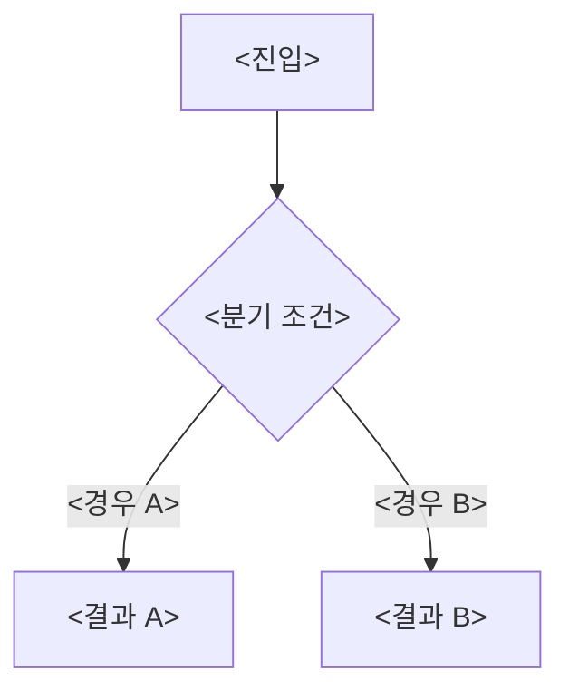
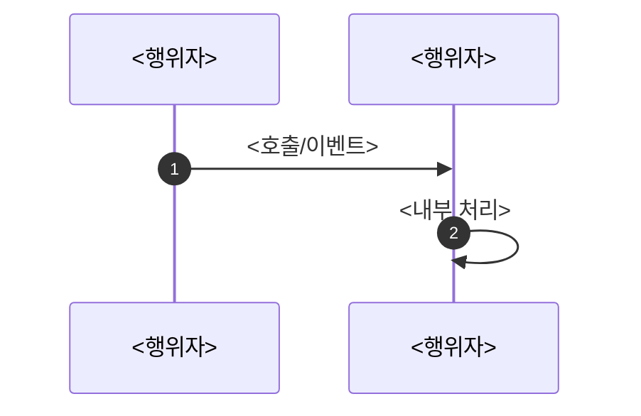

<!--
시스템/컴포넌트 분석 문서 템플릿.
이 파일을 복사해 `<주제>.md` 로 만들고, <...> 자리와 안내 주석을 채우거나 지운다.
필요 없는 섹션은 통째로 지운다 — 모든 섹션이 모든 분석에 필요하진 않다.

작성 원칙
- 넓게 → 좁게: 한 문장 요약 → 전체 그림 → 분기/경로별 상세 → 디테일.
- "축"을 먼저 잡는다. 시스템을 가르는 1~2개의 결정 축을 앞에 박으면 나머지가 그 위에 얹힌다.
- 다이어그램·표는 설명을 대신할 때만. 산문으로 충분하면 만들지 않는다.
- 중복 금지: 같은 내용을 요약·표·산문에서 반복하지 않는다.
- 코드 근거는 짧게. 핵심 함수/조건만, 파일 경로는 맨 끝 "참조 코드"에 모은다.
-->

# <시스템/컴포넌트> — <무엇을 분석하는지>

<이 문서가 다루는 범위 한 줄.>

---

## 한 문장 요약

> <시스템이 무엇을, 어떤 조건에서 하는지 한두 문장으로. 권한/네트워킹 같은 큰 전제도 여기.>

<이 시스템을 가르는 축을 1~2개로 제시.>

- **<축 1>** — <갈림길 A> / <갈림길 B>
- **<축 2>** — <갈림길 A> / <갈림길 B>

---

## 전체 그림

<!-- 큰 줄기만 한 장으로. 세부는 생략. -->

---

## <핵심 로직>

<판정·처리가 모이는 핵심 지점을 짚는다. 순서가 중요하면 번호 목록으로.>

1. <첫 가드/조기 종료 — 왜 여기서 거르는지>
2. <다음 단계>
3. <분기 진입>

| 분기 | 조건 | 동작 |
| --- | --- | --- |
| **<A>** | <조건> | <동작> |
| **<B>** | <조건> | <동작> |

> <쉽게 놓치는 전제나 설계 의도.>

---

## 경로/단계별 상세

<각 경로(또는 단계)를 짧게. 설계 이유를 함께.>

<!-- 시간순 협력이 핵심이면 sequenceDiagram, 아니면 지운다. -->

- **<핵심 포인트>** — <왜 이렇게 하는지>
- **<엣지/순서 의존>** — <주의할 순서나 타이밍>

---

## 데이터 / 설정  *(있으면)*

<DataTable/DataAsset, 에디터 노출 프로퍼티 등 "어디서 무엇을 설정하나".>

| 설정 | 위치 | 의미 |
| --- | --- | --- |
| `<프로퍼티>` | <인스턴스/기본값/BP> | <무엇을> |

---

## 주의할 점

- **<함정>** — <증상과 회피법>
- **<책임 경계 / 연동>** — <안 하는 일과 그 책임자, 다른 시스템과의 접점·제약>

---

### 참조 코드

| 타입 | 모듈 | 역할 |
| --- | --- | --- |
| `<타입>` | `<모듈>` | <이 분석에서의 역할> |
