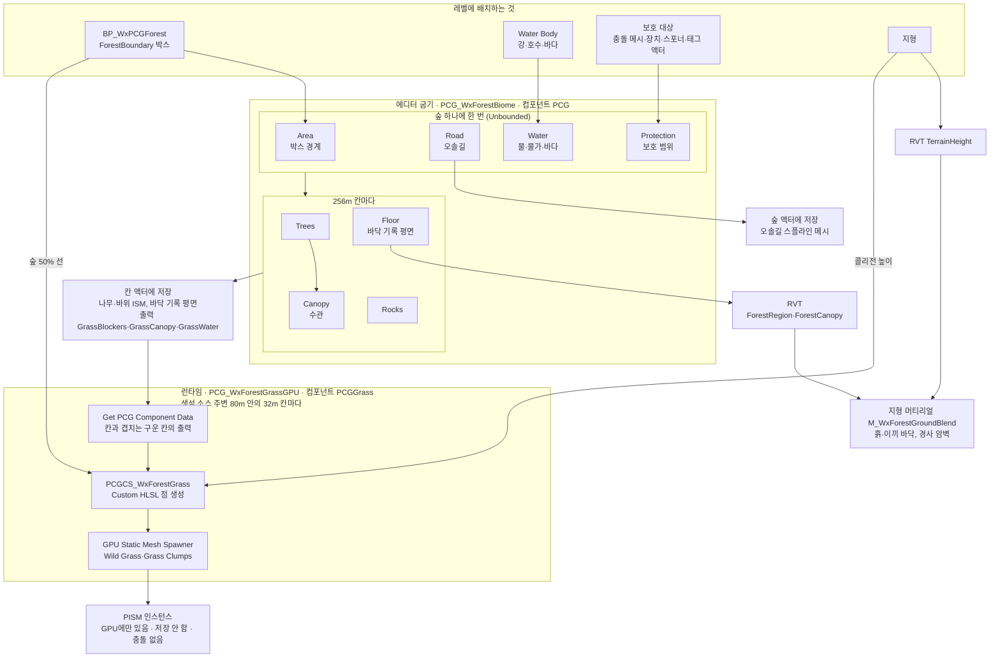

# 숲 바이옴 PCG

박스 하나로 숲을 깔고, 나무·바위·바닥·오솔길은 에디터에서 256m 칸으로 굽고, 풀은 플레이어 주변에서 GPU로 만드는 숲 바이옴 PCG다.

## 기획
- PCG를 어디에 쓰는지(환경별 아트 자동 배치 한정, 직군별 역할)는 [기획 작업 도구](기획-작업-도구.md)의 PCG 방침을 따른다.
- `PCG 개발 방향성`의 숲 바이옴 예시는 흙·이끼 바닥, 나무·바위·풀·잔디·절벽, 오솔길·개울가 스플라인이다.

## 구현
그래프 내부 동작은 10-07·10-08에 에디터와 PIE로 확인했다.

### 한눈에 보기

### 구성

| 에셋 | 역할 |
|---|---|
| `Content/LevelDesign/PCG/Forest/BP_WxPCGForest` | 숲마다 하나씩 배치한다. 루트 박스 `ForestBoundary`(기본 80×80m)와 PCG 컴포넌트 둘을 가진다. |
| `PCG_WxForestBiome` | 컴포넌트 `PCG`가 쓰는 굽기 그래프. 아래 모듈을 잇는다. |
| `Modules/`의 Area·Road·RoadSpline·Water·Protection·Trees·Canopy·Rocks·Floor·EdgeDistance 등 | 굽기 그래프의 서브그래프. |
| `PCG_WxForestGrassGPU` | 컴포넌트 `PCGGrass`가 쓰는 런타임 풀 그래프. |
| `Modules/PCGCS_WxForestGrass` | 풀 규칙을 담은 PCG Compute Source(HLSL). |
| `Content/LevelDesign/PCG/Materials/` | 지형 머티리얼 `M_WxForestGroundBlend`·`MI_WxForestGround`, 바닥 기록 머티리얼, RVT 에셋. |
| `Content/LevelDesign/PCG/Maps/LV_WxForestBiomeOpenWorld` | 데모 레벨. |

### 굽는 것과 런타임에 만드는 것

| 대상 | 계산 단위 | 만드는 때 | 저장 |
|---|---|---|---|
| 숲 경계·오솔길·물·보호 범위 | 숲 하나에 한 번 (계층 생성 기본 격자 Unbounded) | 에디터 굽기 | 오솔길 스플라인 메시만 숲 액터에 |
| 나무·수관·바위·바닥 기록 평면 | 256m 칸 (`Change Grid Size` 256m 뒤, `PCGWorldActor` 격자 25600) | 에디터 굽기 | 칸 액터(`PCGPartitionGridActor_25600_x_y`) |
| 풀 입력(`GrassBlockers`·`GrassCanopy`·`GrassWater`) | 256m 칸 | 에디터 굽기 | 칸 액터의 PCG 컴포넌트 출력 |
| 풀 | 32m 칸, 생성 소스 반경 80m(88m 밖은 지움) | 런타임(GenerateAtRuntime) | 저장하지 않음 |

- 구운 결과는 같은 입력이면 다시 구워도 같다. 런타임 풀은 시드를 칸 위치로 정해 같은 자리에 같은 풀이 난다.
- 생성 소스는 플레이어이고, 에디터 미리보기에서는 뷰포트 카메라다.

### 숲 범위와 가장자리
- 숲 범위는 박스의 수평 가장자리다. 위치·수평 회전·크기(액터 배율과 Box Extent 모두)를 따르고 박스 높이는 쓰지 않는다. 지면은 박스 중심 위아래 30m 안에서 찾는다.
- 박스 가장자리가 숲이 닿는 바깥 끝(0%)이고, 가장자리 전환의 50% 선은 안쪽 6m다.
- `PCG_WxForest_Area`가 박스 네 모서리로 닫힌 직선 경계를 만들어, 나머지 모듈은 예전 스플라인 때와 같은 경계 데이터(BoundaryXY·InteriorXY·Boundary)를 받는다.
- 나무는 숲 경계, 도로 비움 범위, 강·호수 물가(수면 1m 여유선), 기존 배치물 보호 범위, 바다 해안선 중 가장 가까운 곳을 가장자리로 본다. 가장자리에서 배치·성목 확률 50%로 시작해 안쪽 6m에서 100%·85%가 된다(1de23f925).

### 지면·RVT·절벽
- 숲 마스크용 RVT 볼륨은 숲 BP가 아니라 레벨에 둔다. 데모 레벨에는 엔진 `RuntimeVirtualTextureVolume` 세 개(`RVTVolume_ForestRegion`·`RVTVolume_ForestCanopy`·`RVTVolume_TerrainHeight`)가 지형 전체를 덮는다.
- 바닥 기록 평면은 경계 안쪽 24m까지만 2m 간격으로 깔고, 그 안쪽은 16m 간격 32m 평면으로 덮는다. 기록 평면(`M_WxForest*Writer`)은 원경에 보이지 않게 HLOD에서 뺀다.
- 나무 그늘 밀도는 이끼가 날 확률만 정하고, 이끼 모양은 `M_WxForestGroundBlend`의 월드 좌표 노이즈와 이끼 높이맵이 만든다(7ede777af).
- 절벽은 메시를 두지 않고 지형 머티리얼이 칠한다. 보행 한계(`CliffWalkableAngle` 44.765°, CharacterMovement 기본 Walkable Floor Angle)보다 가파르면 모두 암벽(Megascans Rock Cliff 2K, 3방향 월드 투영)이고, 완만한 쪽 `CliffBlendAngle`(15°)은 노이즈와 암벽 높이맵으로 섞는다.
- 지형 격자 한 칸 안에서 평지가 수직으로 꺾이는 가장자리는 경사만으로 번지지 않는다. 그래서 지형이 높이를 `RVT_WxTerrainHeight`에 기록하고, 머티리얼이 주변 네 점(`CliffBleedRadiusCm` 300의 0.35~1배, 노이즈로 흔듦) 높이의 2차 차분으로 절벽 위아래 가장자리를 찾아 암벽을 번지게 한다. 일정하게 기운 경사는 0이다.
- 높이 RVT 볼륨이 없으면 네 점 높이가 0으로 읽혀 지형 전체가 암벽이 된다.
- 엔진 격자 머티리얼(`M_ProcGrid`)을 쓰는 레벨에서는 숲 바닥과 절벽 암벽이 나오지 않는다. 나무·바위·풀은 RVT 없이도 나오지만, 오솔길 머티리얼 `M_WxForestPath`는 숲 경계 RVT로 투명도를 정해 RVT 볼륨이 없으면 길이 보이지 않는다.

### 보호·물·바다
- 기존 배치물 보호는 `PCG_WxForest_Protection`, 물 회피는 `PCG_WxForest_Water`(Water Body 강·호수·바다)가 맡는다. 08-08의 옛 `PCG_Forest`와 그 제외 브랜치는 그래프째 없어졌다.
- 보호 대상은 루트 컴포넌트의 충돌이 켜진 스태틱·다이내믹 메시, `WxDevice`, `WxSpawner`, 배치된 적의 충돌 캡슐, WxPCGProtect·WxPCGExclude 태그 액터다. 충돌 판정은 `BP_WxPCGFilterCollidableMeshes`가 한다(4b5f36877).
- 보호 범위는 액터 범위에 사방 150cm를 더한 사각형이고 높이는 따지지 않는다. WxPCGGround·WxPCGIgnore 태그 액터는 충돌이 있어도 보호에서 빠진다. PlayerStart는 보호하지 않는다(4b5f36877).
- 바다(`WaterBodyOcean`)는 액터 높이를 수면으로 보고, 그 아래를 수평 무한 범위로 나무·바위·풀에서 뺀다. 후보 점의 높이 범위가 판정에 들어가 실제 여유는 수면 위 약 1~1.5m다. 해안선은 2m 간격 지면 표본 중 수면 아래인 점으로 잡는다(1de23f925).

### GPU 풀
- 풀 규칙은 `PCGCS_WxForestGrass`가 CPU 모듈 시절과 같은 순서로 판정한다.

| 단계 | 규칙 |
|---|---|
| 후보 | 32m 칸을 72×72칸(약 44cm)으로 나눠 칸마다 하나를 흔들어 둔다. |
| 숲 가장자리 | 숲 50% 선 ±4.5m에 걸쳐 0%→100%. |
| 경사 | 지형 법선 Z가 `GrassMinNormalZ`(cos 45°) 미만이면 뺀다. |
| 군락 | 약 4m 3옥타브 값 노이즈가 0.48 미만이면 뺀다. |
| 물 | 물 다각형 안은 빼고, 물가 4.5m까지는 밀도 0.7배를 더한다. |
| 밀도 | `GrassDensity`(2.8/m²)에 맞춰 남긴다. |
| 장애물 | 밑동·바위·길·보호·빈터·바다 박스와 겹치면 뺀다. |
| 종류 | 수관 가장자리 안쪽 2m에 걸쳐 Wild Grass 비율 35%→8%, 나머지는 Grass Clumps. |

- 밀도·경사는 `PCG_WxForestGrassGPU`의 그래프 파라미터다. 그 밖의 수치는 HLSL 안에 있다.
- 굽기 그래프는 칸마다 풀 입력을 출력 핀으로 남긴다. `GrassBlockers`는 나무·바위 점, 칸 밖 30m까지 자른 길·보호·빈터 점, 바다 점이고, `GrassCanopy`는 수관 점, `GrassWater`는 칸 밖 10m 사각형으로 자른 물 다각형 꼭짓점(HoleIndex 포함)이다. 예전 `RoadClearance` 출력은 읽는 곳이 없어 뺐다.
- 풀 높이는 GPU 지형 데이터의 콜리전 높이로 읽어서(`bSampleVirtualTextures` 끔) 지형 위에만 난다. 예전 CPU 풀은 아래로 쏜 레이가 맞은 표면에 났다.
- 그리기 컬링은 예전과 같은 45~65m이고 그림자를 드리우지 않는다.
- 리슨 서버 호스트가 원격 플레이어 주변 풀까지 만들지 않게 `Config/DefaultEngine.ini`에 `pcg.RuntimeGeneration.Server.Mode=1`(로컬 생성 소스만)을 둔다.

### 운용
- 숲 크기 지침은 `PCG_WxForestBiome` 그래프 설명에 있다. 숲은 지역별로 나누고, 하나는 2km×2km(64칸) 안팎을 권장하며 최대는 월드 크기(4×4km)다.
- 숲 하나 안의 강·도로·보호 대상이 바뀌면 그 숲 전체를 다시 굽는다. 굽는 동안 숲 범위 전체(지형, 물, 보호 대상)가 에디터에 로드돼 있어야 한다.
- 새 맵에 숲을 깔면 그 맵에도 RVT 볼륨 세 개를 두고, 지형 머티리얼을 `MI_WxForestGround`로, 지형의 Draw in Virtual Textures에 `RVT_WxTerrainHeight`를 넣는다. 숲 바닥 기록 평면이 Z=0에 깔려서 볼륨 높이 범위가 0을 포함해야 한다.
- 생성물이 HLOD에 들도록 `ForestBoundary`를 Static으로 둔다.
- 에디터에서 풀을 보려면 레벨 `PCGWorldActor`의 Treat Editor Viewport As Generation Source를 켠다(데모 레벨은 켜 둠). 에디터 뷰포트가 활성 창일 때만 갱신된다.

| 측정(에디터 DebugGame, 노트북 RTX 3070) | 값 |
|---|---|
| 2km(64칸) 굽기, 풀까지 굽던 10-07 | 796초, 에디터 무응답 약 60초, 메모리 9.0GB |
| 2km(64칸) 굽기, 풀을 런타임으로 옮긴 10-08 | 6분 이내, 무응답 0초, 최대 4.3GB |
| 2km 숲 한가운데 GPU 프레임 시간(PIE, 창 비활성) | 풀 끔 20ms → 풀 켬 48ms, 게임·렌더 스레드는 같음 |

### 엔진 동작에 기댄 곳
- RVT 에셋 하나는 볼륨 하나에만 묶인다(`URuntimeVirtualTexture::Initialize`가 변환·리소스를 에셋에 하나만 둔다). 숲마다 볼륨을 두면 마지막에 로드된 숲에만 마스크가 나와서, 볼륨을 레벨 단위로 둔다.
- PCG 스태틱 메시 스포너는 루트 컴포넌트의 이동성을 생성물에 그대로 복사하고, Movable 스태틱 메시는 HLOD에서 빠진다. 그래서 숲 BP의 루트를 Static으로 둔다.
- PCG의 액터 범위 계산(`PCGHelpers::GetActorBounds`)은 충돌 없는 컴포넌트도 넣는다. 프로퍼티 추출은 블루프린트에 노출된 프로퍼티만 읽어 `FBodyInstance::CollisionEnabled`를 볼 수 없다. 그래서 충돌 메시 판정을 BP 노드로 한다.
- 엔진 바다는 물 영역 전체에 같은 높이로 물을 그려 해안선 모양이 따로 없다. 그래서 바다 판정은 높이로만 한다.
- PCG 보호 사각형은 경사도 0.5면 실제 비움 범위가 1.5배가 된다(`(2 - Steepness) × Bounds`). 보호 범위는 경사도를 1로 올려 쓴다.
- PCG `Get Actor Data`의 단일 점 모드는 액터 변환과, PCG 생성물을 뺀 컴포넌트의 로컬 범위를 준다. 숲 박스는 이 점의 배율에 범위를 곱해 네 모서리를 만든다.
- PCG `AllWorldActors` 선택은 `TActorIterator`로 로드된 액터만 찾는다(`UPCGActorHelpers::ForEachActorInWorld`). 그래서 굽는 동안 숲 범위가 로드돼 있어야 한다.
- 머티리얼에 Runtime Virtual Texture Output 노드가 없으면 그 프리미티브는 RVT에 그리지 않는다(기본 머티리얼로 대체하지 않는다). 그래서 지형 머티리얼에 World Height 출력을 둔다.
- 지형은 RVT의 거친 밉 페이지를 낮은 LOD로 그린다. 거친 밉 높이를 흐린 높이로 쓰면 LOD 격자만큼 넓게 어긋나서, 절벽 둘레는 기본 밉으로 네 점을 읽어 찾는다.
- 계층 생성에서 노드의 격자는 입력 격자 중 가장 작은 값이다. 출력 노드에 칸 데이터를 이으면 출력 노드가 칸마다 돌아 숲 액터에서 만든 데이터가 칸마다 복제되므로, 그런 데이터는 칸으로 자르거나 한 점짜리만 그대로 둔다.
- PCG GPU 노드는 점·속성 세트·지형·텍스처·가상 텍스처·스태틱 메시만 입력으로 받는다(`PCGComputeCommon` `GetAllowedInputTypesList`). 그래서 물 다각형은 꼭짓점 점으로, 빈터는 액터 단일 점으로 바꿔 넘긴다.
- PCG의 가상 텍스처 GPU 샘플은 페이지 상주를 요청하지 않고 이미 상주한 가장 고운 밉을 읽는다(`PCGVirtualTextureDataInterface.ush`). 그래서 GPU 풀은 배치 판정에 RVT를 쓰지 않는다. GPU 지형 데이터도 지형에 WorldHeight RVT가 있으면 기본으로 그것을 읽어서 끈다.
- 런타임 생성은 서버에서도 돈다(`pcg.RuntimeGeneration.Server.Mode` 기본 2: 모든 플레이어 주변). GPU 스포너가 만드는 `UPCGProceduralISMComponent`는 RF_Transient다.

## 결정
- 2026-10-05 숲 RVT 볼륨은 레벨 단위 엔진 볼륨 액터로 두고, 숲 BP에 다시 넣지 않는다. 숲을 여러 개 두는 오픈월드 운용과 원경(HLOD) 표현을 위한 구조다. 숲 RVT·HLOD를 고치자는 제안은 이 구조를 전제로 한다. (구현 리뷰 반영, 커밋 7ede777af)
- 2026-10-07 숲 나무는 숲 경계처럼 도로·강·바다·기존 배치물 가장자리에서도 듬성하고 어린나무 위주로 둔다. 강·바다 속에는 나무·바위·풀·절벽을 두지 않는다. (사용자 결정, 커밋 1de23f925)
- 2026-10-07 숲 기존 배치물 보호에서 PlayerStart를 뺀다. (사용자 결정, 커밋 4b5f36877)
- 2026-10-07 보호 대상 메시는 태그 없이 충돌 여부로 가르고, 판정은 `BP_WxPCGFilterCollidableMeshes`로 한다. 엔진 PCG 노드로는 충돌 설정을 읽을 수 없어 대체하지 않는다. (사용자 결정, 커밋 4b5f36877)
- 2026-10-07 숲 범위를 스플라인에서 박스(Box Volume)로 바꿨다. (사용자 결정)
- 2026-10-07 절벽 메시를 숲 PCG에서 빼고 관련 에셋을 지웠다. 절벽은 Quixel Bridge에서 받은 Rock Cliff로 지형 머티리얼이 캐릭터가 오를 수 없는 경사에 칠한다. (사용자 결정)
- 2026-10-07 절벽 경계가 칼같은 문제는 지형 높이 RVT로 절벽 둘레에 번지게 해서 푼다. 경사만 쓰는 방식은 1m 격자 안에서 꺾이는 가장자리를 못 풀고, PCG가 RVT에 기록하는 방식은 숲 안에서만 된다. (사용자 결정)
- 2026-10-07 PCG에서 안 쓰는 머티리얼·메시를 지웠다. 참조가 하나도 없거나 안 쓰는 에셋에서만 참조되는 것만 지웠다(`M_WxForestProtectionWriter`, Mossy_Rock_tjcoefsda·Velvet_Grass_tkbidaxia 묶음). (사용자 결정)
- 2026-10-07 숲을 월드 전체에 깔면 굽기가 멈추는 문제는 256m 칸 파티션 생성으로 푼다. 박스 가장자리는 숲이 닿는 바깥 끝, 50% 선은 안쪽 6m다. 숲 전체에 한 번만 필요한 계산(영역·오솔길·물·보호)은 계층 생성의 Unbounded 단계에서 한다. (사용자 결정)
- 2026-10-08 풀은 굽지 않고 GPU로 런타임 생성한다. 엔진 템플릿 `TPL_Showcase_RuntimeGrassGPU`·BiomeCore 지면 산포와 같은 구조이고, CPU 런타임 생성은 칸마다 노드 25개를 CPU에서 돌려 이동 중 끊김 위험이 남는다. 나무·바위·바닥·오솔길은 계속 굽는다. 풀 규칙이 HLSL로 옮겨져 노드로는 고칠 수 없고 밀도·경사만 그래프 파라미터로 남는다. CPU 풀 모듈 `PCG_WxForest_Grass`는 지웠다. (사용자 제안·결정)
- 2026-10-08 숲 크기는 그래프나 검증으로 강제하지 않고 지침으로만 둔다. 월드(4×4km)를 숲 하나로 덮어도 256칸·약 10~25분 굽기(추정)라 감당할 만하고, 그래프에서 자르면 숲이 말없이 잘린다. 실제 부담은 바뀔 때 숲 전체를 다시 굽는 범위라서, 지역별로 2km 안팎으로 나누기를 권장한다. (사용자 결정)

## 미결
- 지형 머티리얼을 바꾸지 않고 숲 바닥(흙·이끼)을 내는 방법은 보류했다(10-07). 지금은 지형 머티리얼이 RVT를 읽어야 바닥이 보여서, 엔진 격자 머티리얼(`M_ProcGrid`)을 쓰는 LV_OpenWorld에는 바닥이 나오지 않는다. 데칼, 지면 타일 메시, 숲 BP 안의 RVT 볼륨, 볼륨 자동 생성을 검토했고 고르지 않았다. 여러 바이옴을 섞어 쓸 계획이 판단 기준이다.
  - 10-07 절벽 암벽도 지형 머티리얼이 칠하게 되어 같은 조건을 따른다. 격자 레벨에서 오솔길이 투명해지는 문제는 'RVT 값이 0이면 RVT 없는 레벨로 보고 불투명'으로 고치는 안을 제안했고 정하지 않았다.
- 설원·사막 바이옴이 늘면 RVT를 공용으로 쓰기로 하고 세부 설계는 두 번째 바이옴 때 정한다(10-07, 사용자 결정).
  - 정할 것: 채널 배분, 바이옴 기록이 겹칠 때의 규칙, 압축 여부, 바이옴 경계 규칙, 바이옴별 절벽 재질, 합성 지형 머티리얼 1회 교체, RVT 볼륨 자동 배치.
  - 4채널 RVT(Mask4)는 기록 머티리얼 하나가 네 채널을 같은 불투명도로 덮어써서, 겹친 기록자끼리 서로의 채널을 지운다. 채널당 8비트이고 압축하면 DXT5라 RGB 채널이 압축 블록을 공유한다(UE 5.8 `VirtualTextureMaterial.usf`·`RuntimeVirtualTexture.cpp`).
  - 숲 BP들은 서로를 모른 채 생성해서, 박스가 겹치면 양쪽이 다 생기고 맞닿으면 양쪽 6m 전환이 겹쳐 그 띠가 듬성해진다. 지역별로 숲을 나누면 이 경계가 늘어난다.
- 풀을 그리는 GPU 비용(10-08 에디터 측정 +28ms)을 줄일지 정하지 않았다. 밀도, 컬링 거리, 풀 메시 LOD가 후보다.

## 관련
- [기획 작업 도구](기획-작업-도구.md)
- [초반 구간과 퀘스트](초반-구간과-퀘스트.md)

## 출처
- [PCG 개발 방향성](../summaries/PCG-개발-방향성.md)
- 사용자 대화: 숲 PCG 가장자리·기존 배치물 보호·바다 처리와 지형 무변경 숲 바닥 검토 (2026-10-07)
- 사용자 대화: 숲 범위 박스 전환, 절벽 메시 제거와 지형 머티리얼 암벽·높이 RVT 번짐, PCG 미사용 에셋 정리, 다중 바이옴 공용 RVT 보류 (2026-10-07, 커밋 전 작업 트리를 에디터로 확인)
- 사용자 대화: 숲 월드 전체 깔기의 파티션 생성·Unbounded 단계, 풀 GPU 런타임 생성, 숲 크기 지침 (2026-10-07~08, 커밋 전 작업 트리를 에디터·PIE로 확인)
- `Content/LevelDesign/PCG/` (0f79eb099)
- `Content/__ExternalActors__/LevelDesign/PCG/Maps/LV_WxForestBiomeOpenWorld` (7ede777af)
- `Config/DefaultEngine.ini` (커밋 전)
